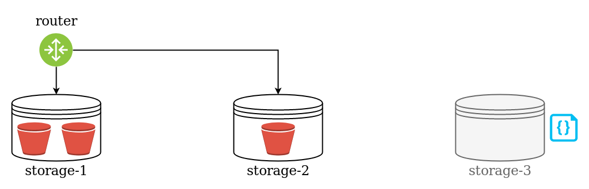
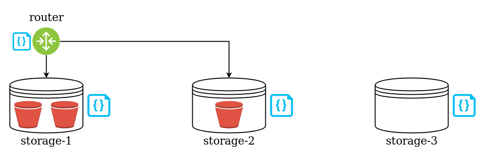
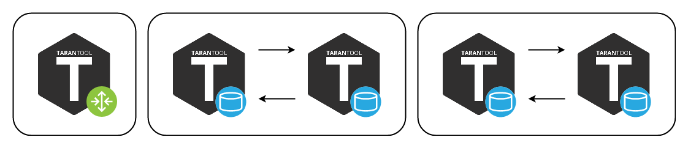
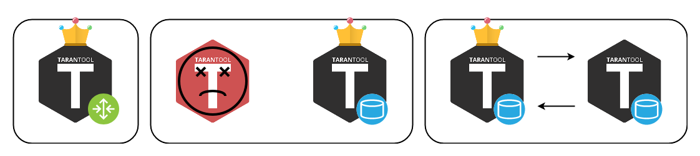
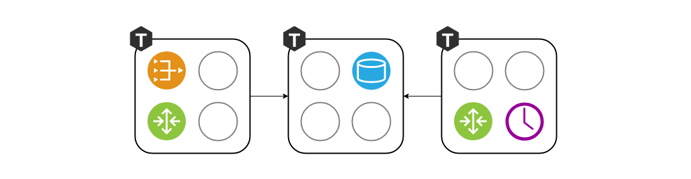

<!-- ############################################################ -->
## Tarantool =

.center[
<br/>

]

.pull-left[.center[
Database
<br/><br/>
(Transactions, WAL)
]]

.pull-right[.center[
Application server (Lua)
<br/><br/>
(Business logics, HTTP)
]]

???

* Вопрос залу - Кто работал? Кто слышал название?
* Тарантул - это ...

<!-- ############################################################ -->
---

## Core team

* `20` C developers
* Product development

## Solution team
* `35` Lua developers
* Commertial projects

???

* Большая команда - 70 человек
* Условно две половинки
* Команда ядра развивает опенсорс платформу
* Команда решений делает коммерческие проекты

--

## Common goals

* Make development **fast** and **reliable**

???

* Делимся опытом и проблемами
* Чтобы не было багов
* Главное - Чтобы разработка велась быстро

<!-- ############################################################ -->
---
## In-memory no-SQL

* Not only in-memory: `vinyl` disk engine
* Supports SQL (since v.2)

???

* Помимо тех преимуществ, которые нам даёт объединение
  сервера приложений и БД у тарантула есть и другие
* Уже давно не только in-memory - есть винил
* И даже SQL есть

--

### But

* We need **scaling** (horizontal)

???

* И тем не менее нужно уметь масштабироваться

<!-- ############################################################ -->
---
## Vshard - horizontal scaling in tarantool

- Vshard assigns data to virtual buckets
- Buckets are distributed across servers

.override[]
???
- Вшард - опенсорс модуль, который делает БД распределённой
- Вшард группирует записи по виртуальным бакетам (отсюда название)
- Бакетов много, вшард организует маршрутизацию
- И помогает в балансировке

Объяснение картинки
--
.override[]
???
Что делать, когда стало тесно?
--
.override[]
???
Сначала нужно обновить конфиг
--
.override[]
???
Стартануть новый инстанс
--
.override[]
???
И применить этот конфиг к старым инстансам
--
.override[]
???
Готово! Желательно на лету. Все конфиги должны быть одинаковые.

<!-- ############################################################ -->
---
## Vshard configuration

- Lua tables

```lua
sharding_cfg = {
    ['cbf06940-0790-498b-948d-042b62cf3d29'] = {
        replicas = { ... },
    },
    ['ac522f65-aa94-4134-9f64-51ee384f1a54'] = {
        replicas = { ... },
    },
}
```
```lua
vshard.router.cfg(...)
vshard.storage.cfg(...)
```

???

- На самом деле это не просто
- История с митапа хайлоада-2018
- Какие могут быть сюрпризы?

<!-- ############################################################ -->
---
## Vshard automation. Options

- Deployment scripts
- Docker compose
- Zookeeper

???

- Никто не хочет заниматься этим вручную
- Мы тоже пробовали разные варианты
- Какие сложности:
- - Применять конфигурации на лету
- - Следить за разнородными сервисами
- - Не допустить потери данных

<!-- ############################# -->
--

- Our own orchestrator

???

- Мы решали мелкие проблемы, и система становилась неудобной
- Мы стали пробовать написать свой собственный оркестратор
- Благо у нас есть сервер приложений

<!-- ############################################################ -->
---
## Orchestrator requirements

- Doesn't start/stop instances (systemd can do that)
- Applies configuration only
- Every cluster node can manage others
- Built-in monitoring

???

- Изначатьно требования сложились примерно такие
- Мы не следим за запуском процессов
- Управлять кластером можно с любого узла
  (нет никаких причин делать иначе)
- Нам нужен мониторинг
  (в каком состоянии находится каждый узел)

<!-- ############################################################ -->
---
## Clusterwide configuration

- **Must** be the same everywhere
- Applied with two-phase commit

```yaml
topology:
* servers:                # two servers
    s1:
      replicaset_uuid: A
      uri: localhost:3301
    s2:
      replicaset_uuid: A
      uri: localhost:3302
* replicasets:            # one replicaset
    A:
      roles: ...
```

???

- В отличие от вшарда, у кластера один общий конфиг
- Чтобы он не разъехался, будем применять его двухфазно
- Задача выглядит не сложной, всего лишь 2pc.
- Все инстарументы у нас есть,

<!-- ############################################################ -->
---
## Which came first?

.center[

]
.pull-left[.pull-right[.center[
Database
<br/>
`tcp_listen()`
]]]
.pull-right[.pull-left[.center[
Orchestrator
<br/>
`apply_2pc()`
]]]

???

- На самом деле нет
- Бинарный протокол Тарантула - это часть базы
- Как сконфигурировать сервер, который ничего не сконфигурировал
- Стандартный способ решить эту проблему - разоравать порочный круг

<!-- ############################################################ -->
---
## Membership implementation

- SWIM protocol - one of gossips family

### Картинка как работает свим

???

- Поможет нам в этом мониторинг
- Как именно - станет ясно чуть позже, а пока про сам протокол
- Свим протогол
- Оч классный, меньше всего проблем с ним было

<!-- ############################################################ -->
---
## Bootsrapping new instance

.pull-left-70[
<br/>
1. New process starts
1. New process joins membership
1. Cluster checks new process is alive
1. Cluster applies configuration
1. New process polls it from membership
1. New process bootstraps
<br/>
<br/>
1. Repeat N times
]
--
.pull-right-30[.center[
<br/>

N = 100
]]

<!-- ############################################################ -->
---
## Benefits so far

<br/>

1. Orchestration works

.override[.ilustrate[]]
--
.override[.ilustrate[]]
--
.override[.ilustrate[]]

<!-- ############################################################ -->
---
## Benefits so far

<br/>

1. Orchestration works
1. Monitoring works

.override[.ilustrate[]]
--
.override[.ilustrate[]]

<!-- ############################################################ -->
---
## Benefits so far

<br/>

1. Orchestration works
1. Monitoring works
1. We can assign any role to the instance

<!-- .override[.ilustrate[]]
-- -->
.override[.ilustrate[]]
--
.override[.ilustrate[]]

<!-- ############################################################ -->
---
## Role management

<br/>
- `function init()`
???
Когда дёргается инит?<br/>
Что можно/нужно делать на ините?
--
- `function validate_config()`
- `function apply_config()`
???
Роли могут пользоваться распределённым конфигом.
Что полезного там можно хранить?
--
- `function stop()`
???
Зачем нужен стоп

<!-- ############################################################ -->
---
## Refactoring the bootstrap process

<br/>

- Assembling large clusters with 100+ instances is slow
- N two-phase commits are slow
- N config pollings is slow

--

### Solution

- Bootstrap all instances with a single 2pc
- Re-implement binary protocol and reuse port

???

- Но вернёмся к нашей проблеме

<!-- ############################# -->
---
## Links

- [tarantool.io](https://www.tarantool.io/)
- [github.com/tarantool/tarantool](https://github.com/tarantool/tarantool)
- Telegram -
  [@tarantool](https://t.me/tarantool),
  [@tarantool_news](https://t.me/tarantool_news)
<br/>
<br/>
- Cartridge Framework - [github.com/tarantool/cartridge](https://github.com/tarantool/cartridge)
- Cartridge CLI - [github.com/tarantool/cartridge-cli](https://github.com/tarantool/cartridge-cli)
<br/>
<br/>
- Posts on Habr - [habr.com/users/rosik/](https://habr.com/users/rosik/)
- This presentation - [rosik.github.io/2019-bigdatadays](https://rosik.github.io/2019-bigdatadays)

## Questions?