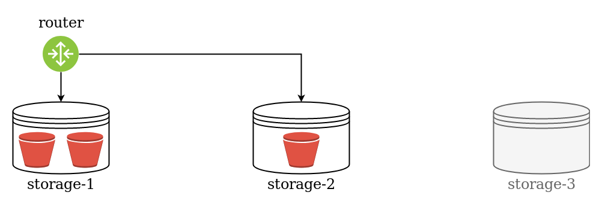
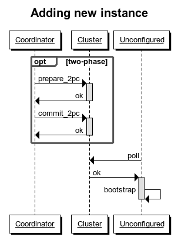

<!-- ############################################################ -->
## Tarantool =

.center[

]

.pull-left[.center[
База данных
<br/><br/>
(Транзакции, WAL)
]]

.pull-right[.center[
Сервер приложений (Lua)
<br/><br/>
(Бизнес логика, HTTP)
]]

???

* Вопрос залу - Кто работал? Кто слышал название?
* Тарантул - это ...
* Применяется он в самых разных сценариях:
  как бд кеши, очереди, сессии; и как аппсервер

<!-- ############################################################ -->
---

## Ядро

* 20 разработчиков C
* Развитие продукта

## Команда решений
* 35 разработчиков Lua
* Коммерческие проекты

???

* Коллекив 70 человек
* Преимущественно программисты
* Условно две половинки
* Команда ядра развивает опенсорс платформу
* Команда решений делает коммерческие проекты

--

### Цели

* Меньше багов, больше продуктивность

???

* Делимся опытом и проблемами
* Чтобы не было багов
* Главное - Чтобы разработка велась быстро
* Об этом "быстро" мы и поговорим

<!-- ############################################################ -->
---
## Инструменты разработчика

.override[.center[]]
???

* Давайте посмотрим на набор инструментов,
  которые есть у нас в распоряжении
* Самый главный инструмент - тарантул.
  Не только In-memory, не тоьлко no-SQL

--
.override[.center[]]
???
* На его основе мы делаем проекты

--
.override[.center[]]
???
* Но нужно уметь масштабироваться

--
.override[.center[]]
???
* Два инстанса, а между ними пропасть

--
.override[.center[]]
???
* Для этого есть вшард, делает базу распределенной.
* Не первая попытка сделать шардинг. Было ещё две.
* Третья получилась удачной, но всё равно не всемогущей.

<!-- ############################################################ -->
---
## Конфигурация vshard

- Vshard управляется программно:

```lua
sharding_cfg = {
    ['cbf06940-0790-498b-948d-042b62cf3d29'] = {
        replicas = { ... },
    },
    ['ac522f65-aa94-4134-9f64-51ee384f1a54'] = {
        replicas = { ... },
    },
}
```
```lua
vshard.router.cfg(...)
vshard.storage.cfg(...)
```

???
- Во-первых,  дело в удобстве
- Вшард управляется программно

<!-- ############################################################ -->
---
## Vshard - горизонтальное масштабирование в Tarantool

- Vshard группирует данные по виртуальным "ведёркам"
- Ведёрок много, они распределены по серверам

.override[]
???
- Вшард - опенсорс модуль, который делает БД распределённой
- Вшард группирует записи ... (отсюда название)
- Бакетов много, вшард организует маршрутизацию
- И помогает в балансировке
- Вот здесь на схеме 2 стораджа

<!-- ############################# -->
--
.override[]
???
- Стало тесно

<!-- ############################# -->
--
.override[]
???
- Сначала нужно обновить конфиг

<!-- ############################# -->
--
.override[]
???
- Стартануть новый инстанс. Но старые пока не знают

<!-- ############################# -->
--
.override[]
???
- И применить этот конфиг к старым инстансам

<!-- ############################# -->
--
.override[]
???
- Теперь вшард перетащит туда часть данных

<!-- ############################################################ -->
---
## Оркестрация vshard

.override[.center[]]
???

- Никто не хочет заниматься этим вручную
- Мы тоже пробовали разные варианты

--
.override[.center[]]
???
- Какие сложности:
- - Применять конфигурации на лету
- - Следить за разнородными сервисами
- - Не допустить потери данных

- Мы решали мелкие проблемы
- Cистема становилась неудобной
-
- Благо у нас есть сервер приложений

<!-- ############################################################ -->
---
## Организация бизнес логики

.override[.ilustrate[]]
???
- Разработка приложения не начинается с деплоя

--
.override[.ilustrate[]]
--
.override[.ilustrate[]]
--
.override[.ilustrate[]]
--
.override[.ilustrate[]]

<!-- ############################################################ -->
---
## Как должно выглядеть управление кластером?

- Мы запускаем процессы
- Конфигурацией vshard управляет Tarantool

.override[.ilustrate[]]
???
- пользователь жмёт кнопку одну кнопку в веб-интерфейсе
- Мы не следим за запуском процессов
- Управлять кластером можно с любого узла
  (нет никаких причин делать иначе)
- Нам нужен мониторинг
  (в каком состоянии находится каждый узел)

--
.override[.ilustrate[]]

<!-- ############################################################ -->
---
## Конфигурация кластера

- Одинаковая **везде**
- Обновляется двухфазным коммитом
- Самое главное - **топология**:

```yaml
topology:
* servers:                # two servers
    s1:
      replicaset_uuid: A
      uri: localhost:3301
    s2:
      replicaset_uuid: A
      uri: localhost:3302
* replicasets:            # one replicaset
    A:
      roles: ...
```

???

- В отличие от вшарда, у кластера один общий конфиг
- Чтобы он не разъехался, будем применять его двухфазно
- Задача выглядит не сложной, всего лишь 2pc.
- Все инструменты у нас есть,


<!-- ############################################################ -->
---
## Курица или яйцо?

.center[

]
.margin-top-0[
	.pull-left[.pull-right[.center[
	База данных
	<br/>
	`net.box call`
	]]]
	.pull-right[.pull-left[.center[
	Новый процесс
	<br/>
	`box.cfg listen`
	]]]
]

???

- На самом деле нет
- Бинарный протокол Тарантула - это часть базы
- Как сконфигурировать сервер, который ничего не сконфигурировал
- Стандартный способ решить эту проблему - разоравать порочный круг

<!-- ############################################################ -->
---
## Внутренний мониторинг

- Протокол SWIM - распространение **слухов**

--
.override[.ilustrate[]]
--
.override[.ilustrate[]]
--
.override[.ilustrate[]]
--
.override[.ilustrate[]]

---
## Membership implementation

- SWIM protocol - one of the **gossips** protocols family
- Dissemination speed: O(logN)
- Network load: O(N)

.override[.ilustrate[]]
--
.override[.ilustrate[]]

???

- Поможет нам в этом мониторинг
- Как именно - станет ясно чуть позже, а пока про сам протокол
- Свим протогол
- Оч классный, меньше всего проблем с ним было

<!-- ############################################################ -->
---
.pull-left-70[
## Bootsrapping new instance

1. New process starts
1. New process joins membership
1. Cluster checks new process is alive
1. Cluster applies configuration
1. New process polls it from membership
1. New process bootstraps
]

.pull-right-30[.center[.margin-top-0[

]]]

<!-- ############################################################ -->
---
## Benefits so far

1. Orchestration works

.override[.ilustrate[]]
--
.override[.ilustrate[]]
--
.override[.ilustrate[]]

<!-- ############################################################ -->
---
## Benefits so far

1. Orchestration works
1. Monitoring works

.override[.ilustrate[]]
--
.override[.ilustrate[]]

<!-- ############################################################ -->
---
## Role management

- `function init()`
???
Когда дёргается инит?<br/>
Что можно/нужно делать на ините?
--
- `function validate_config()`
- `function apply_config()`
???
Роли могут пользоваться распределённым конфигом.
Что полезного там можно хранить?
--
- `function stop()`
???
Зачем нужен стоп


<!-- ############################################################ -->
---
.pull-left-70[
## Bootsrapping new instance

1. New process starts
1. New process joins membership
1. Cluster checks new process is alive
1. Cluster applies configuration
1. New process polls it from membership
1. New process bootstraps
]

.pull-right-30[.center[.margin-top-0[

]]]

<!-- ############################################################ -->
---
.pull-left-70[
## Bootsrapping new instance

1. New process starts
1. New process joins membership
1. Cluster checks new process is alive
1. Cluster applies configuration
1. New process polls it from membership
1. New process bootstraps
<br/>
<br/>
1. Repeat N times
]

.pull-right-30[.center[.margin-top-0[
<br/>
]]]
???

<!-- ############################################################ -->
---
.pull-left-70[
## Bootsrapping new instance

1. New process starts
1. New process joins membership
1. Cluster checks new process is alive
1. Cluster applies configuration
1. New process polls it from membership
1. New process bootstraps
<br/>
<br/>
1. Repeat N times
]

<br/><br/>
.pull-right-30[.center[.margin-top-0[
<br/>
N = 100
]]]

???

- Но вернёмся к нашей проблеме

<!-- ############################################################ -->
---
## Refactoring the bootstrap process

- Assembling large clusters with 100+ instances is slow
- N two-phase commits are slow
- N config pollings is slow

--

### Solution

- Bootstrap all instances with a single 2pc
- Re-implement binary protocol and reuse port


<!-- ############################################################ -->
---
.pull-left-70[
## Bootsrapping new instance
<br/>
]


<!-- ############################# -->
---
## Links

- [tarantool.io](https://www.tarantool.io/)
- [github.com/tarantool/tarantool](https://github.com/tarantool/tarantool)
- Telegram -
  [@tarantool](https://t.me/tarantool),
  [@tarantool_news](https://t.me/tarantool_news)
<br/>
<br/>
- Cartridge framework - [github.com/tarantool/cartridge](https://github.com/tarantool/cartridge)
- Cartridge CLI - [github.com/tarantool/cartridge-cli](https://github.com/tarantool/cartridge-cli)
- Posts on Habr - [habr.com/users/rosik/](https://habr.com/users/rosik/)
- This presentation - [rosik.github.io/2019-bigdatadays](https://rosik.github.io/2019-bigdatadays)

## Questions?