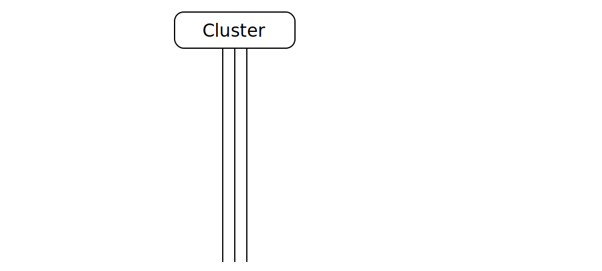

<!-- ############################################################ -->
## Tarantool =

.center[

]

.pull-left[.center[
База данных
<br/><br/>
(Транзакции, WAL)
]]

.pull-right[.center[
Сервер приложений (Lua)
<br/><br/>
(Бизнес логика, HTTP)
]]

???

* Вопрос залу - Кто не знает?
* Тарантул - это ...
* Применяется в самых разных сценариях:
* Иногда ради хранения данных с 1-2 хранимками
* Иногда больше как сервер приложений

<!-- ############################################################ -->
---

## Ядро

* 20 разработчиков C
* Развитие продукта

## Команда решений
* 35 разработчиков Lua
* Коммерческие проекты

???

* Коллектив не перестаёт расти
* сейчас чуть меньше 80
* большая часть из них - разработчики
* Команда ядра развивает опенсорс платформу
* Команда решений делает коммерческие проекты

--

### Цели

* Меньше багов, больше продуктивность

???

* Тесно взаимодействуем
* Чтобы не было багов
* Главное - чтобы разработка велась быстро
* **Об этом "быстро" мы и поговорим**

<!-- ############################################################ -->
---
## Инструменты разработчика

.override[.center[]]
???

* Давайте посмотрим на набор инструментов,
  которые есть у нас в распоряжении
* Самый главный инструмент - тарантул.
* Быстрый, много фич, SQL завезли,
  функ индексы

--
.override[.center[]]
???
* На его основе мы делаем проекты

--
.override[.center[]]
???
* Но нужно уметь масштабироваться

--
.override[.center[]]
???
* Два инстанса, а между ними пропасть

--
.override[.center[]]
???
* Для этого есть вшард, делает базу распределенной.
* Не первая попытка сделать шардинг. Было ещё две.
* Третья получилась удачной, но всё равно не всемогущей.

<!-- ############################################################ -->
---
## Конфигурация vshard

- Vshard управляется программно:

```lua
sharding_cfg = {
    ['cbf06940-0790-498b-948d-042b62cf3d29'] = {
        replicas = { ... },
    },
    ['ac522f65-aa94-4134-9f64-51ee384f1a54'] = {
        replicas = { ... },
    },
}
```
```lua
vshard.router.cfg(...)
vshard.storage.cfg(...)
```

???
- Во-первых,  дело в удобстве
- Вшард управляется программно

<!-- ############################################################ -->
---
## Vshard - горизонтальное масштабирование в Tarantool

- Vshard группирует данные по виртуальным "ведёркам"
- Ведёрок много, они распределены по серверам

.override[]
???
- Вшард - опенсорс модуль, который делает БД распределённой
- Вшард группирует записи ... (отсюда название)
- Бакетов много, вшард организует маршрутизацию
- И помогает в балансировке
- Вот здесь на схеме 2 стораджа

<!-- ############################# -->
--
.override[]
???
- Стало тесно

<!-- ############################# -->
--
.override[]
???
- Сначала нужно обновить конфиг

<!-- ############################# -->
--
.override[]
???
- Стартануть новый инстанс. Но старые пока не знают

<!-- ############################# -->
--
.override[]
???
- И применить этот конфиг к старым инстансам

<!-- ############################# -->
--
.override[]
???
- Теперь вшард перетащит туда часть данных

<!-- ############################################################ -->
---
## Оркестрация vshard

.override[.center[]]
???

- Никто не хочет заниматься этим вручную
- История с хайлоада
- Мы тоже пробовали разные варианты

--
.override[.center[]]
???
- Какие сложности:
- - Применять конфигурации на лету
- - Следить за разнородными сервисами
- - Не допустить потери данных

- Мы решали мелкие проблемы
- Cистема становилась неудобной
- Благо у нас есть сервер приложений

<!-- ############################################################ -->
---
## Организация бизнес логики

.override[.ilustrate[]]
???
- Разработка приложения не начинается с деплоя

--
.override[.ilustrate[]]
--
.override[.ilustrate[]]
--
.override[.ilustrate[]]
--
.override[.ilustrate[]]
???
- Как тестировать?

<!-- ############################################################ -->
---
## Как должно выглядеть управление кластером?

- Мы запускаем процессы
- Конфигурацией vshard управляет Tarantool

.override[.ilustrate[]]
???
- пользователь жмёт кнопку одну кнопку в веб-интерфейсе
- Мы не следим за запуском процессов
- Управлять кластером можно с любого узла
  (нет никаких причин делать иначе)
- Нам нужен мониторинг
  (в каком состоянии находится каждый узел)

--
.override[.ilustrate[]]

<!-- ############################################################ -->
---
## Конфигурация кластера

- Одинаковая **везде**
- Обновляется двухфазным коммитом
- Самое главное - **топология**:

```yaml
topology:
* servers:                # two servers
    s1:
      replicaset_uuid: A
      uri: localhost:3301
    s2:
      replicaset_uuid: A
      uri: localhost:3302
* replicasets:            # one replicaset
    A:
      roles: ...
```

???

- В отличие от вшарда, у кластера один общий конфиг
- Чтобы он не разъехался, будем применять его двухфазно
- Задача выглядит не сложной, всего лишь 2pc.
- Все инструменты у нас есть,


<!-- ############################################################ -->
---
## Курица или яйцо?

.center[

]
.margin-top-0[
	.pull-left[.pull-right[.center[
	База данных
	<br/>
	`net.box call`
	]]]
	.pull-right[.pull-left[.center[
	Новый процесс
	<br/>
	`box.cfg listen`
	]]]
]

???

- На самом деле нет
- Бинарный протокол Тарантула - это часть базы
- Как сконфигурировать сервер, который ничего не сконфигурировал
- Стандартный способ решить эту проблему - разоравать порочный круг

<!-- ############################################################ -->
---
## Внутренний мониторинг

- Протокол SWIM - распространение **слухов** по UDP

.override[.ilustrate[]]
???
- Этим механизмом стал SWIM
--
.override[.ilustrate[]]
--
.override[.ilustrate[]]
--
.override[.ilustrate[]]

---
## Внутренний мониторинг

- Протокол SWIM - распространение **слухов** по UDP
- Всеобщая осведомлённость: O(logN)
- Нагрузка на сеть: O(N)

.override[.ilustrate[]]
???
- Весь кластер узнает о событии за log(N)
- Не слишком сильно нагружает

--
.override[.ilustrate[]]
???
- Событиями в первую очередь являются жив/мертв
- И полезная нагрузка
- Влад расскажет

<!-- ############################################################ -->
---
## Прототип кластера

.override[.ilustrate[]]
???
- получилась схема

--
.override[.ilustrate[]]
--
.override[.ilustrate[]]
--
.override[.ilustrate[]]
--
.override[.ilustrate[]]
--
.override[.ilustrate[]]
--
.override[.ilustrate[]]


<!-- ############################################################ -->
---
## Структура кластера

1. Сервера повсюду

.override[.ilustrate[]]

<!-- ############################################################ -->
---
## Структура кластера

1. Сервера повсюду (объединены в репликационные группы)

.override[.ilustrate[]]

<!-- ############################################################ -->
---
## Структура кластера

1. Сервера повсюду (объединены в репликационные группы)
1. В каждой группе есть "лидер"

.override[.ilustrate[]]

<!-- ############################################################ -->
---
## Структура кластера

1. Сервера повсюду (объединены в репликационные группы)
1. В каждой группе есть "лидер"
1. Внутренний мониторинг позволяет обрабатывать отказы

.override[.ilustrate[]]
--
.override[.ilustrate[]]

<!-- ############################################################ -->
---
## Разработка кастомных ролей

- `function init()`
- `function validate_config()`
- `function apply_config()`
- `function stop()`

.ilustrate[]
???
- Изначально модули были плотно завязаны в коде.
- Хорошая точка расширения.
- Роли могут пользоваться распределённым конфигом.


<!-- ############################################################ -->
---
## Фреймворк разработки распределённых сервисов

.override[.ilustrate[]]


<!-- ############################################################ -->
---
## Проблемы масштабирования

.override[.ilustrate[]]
--
.override[.ilustrate[]]
--
.override[.ilustrate[]]


<!-- ############################################################ -->
---
## Проблема масштабирования №1

- Присоединение инстансов по-одному не эффективно
--
- Надо делать один двухфазный коммит на всех
--
.override[.ilustrate[]]

<!-- ############################################################ -->
---

## Проблема масштабирования №1

* Гонки появляются в другом месте

```lua
box.cfg({
  listen = ...,
  replication = {
    'user:password@localhost:3301',
    'user:password@localhost:3302',
  }
})

box.schema.user.create('user', 'password')
box.schema.user.grant('user', 'replication')
```

<!-- ############################################################ -->
---

## Проблема масштабирования №2

- Поллинг не эффективен
- Проблемы инициализации сложно диагностировать
--

```lua
iproto.listen('0.0.0.0', 3301, {
  username = ...,
  password = ...,
})
```
???
- Почему мы не сделали этого раньше?

--

```lua
conn.eval('
  iproto.stop()
  box.cfg({listen = 3301})
')
```
???
- Прелести

<!-- ############################# -->
---
## Ссылки

- Cartridge framework - [github.com/tarantool/cartridge](https://github.com/tarantool/cartridge)

- Cartridge CLI - [github.com/tarantool/cartridge-cli](https://github.com/tarantool/cartridge-cli)

- This presentation - [rosik.github.io/2019-bigdatadays](https://rosik.github.io/2019-bigdatadays)

<br/>
# Вопросы?