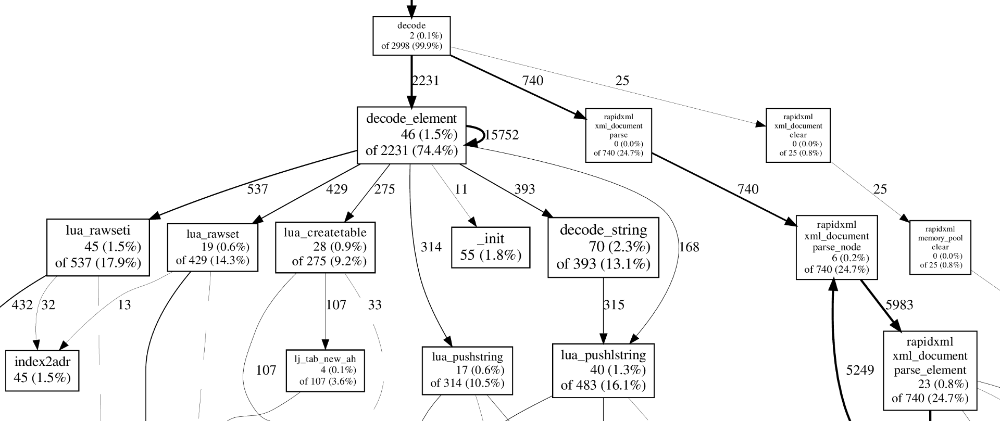

class: center
background-size: contain
background-image: url(bg.png)

.titlepage[
# Tarantool team's experience with Lua developer tools

## Yaroslav Dynnikov
<br>

### Tarantool, Mail<span>.</span>Ru Group

### 3 March 2019
]

???

- My name is
- I work here in tarantool
- Today i'm gonna tell about our **development processes**

<!-- ############################################################ -->
<!-- ---

## Agenda

### - Who we are and what we do
### - Writing better code
- Runtime checks
- Static analysis
- Type checking
- Error handling

### - Testing
- Test frameworks
- Coverage
- Performance tests

### - Shipping
 -->
<!-- ############################################################ -->
---

## Tarantool

Tarantool is an open-source data integration platform

Tarantool = Database + Application server (Lua)

--

## Core team

Focuses on the product development

## Solution team

Implements projects for the Enterprise

???

- Tarantool is
- Rouhly you can think of it
- JuaJIT with DBMS on board

- Actually there are much more features
- but I'll tell about them later


<!--
- Core team develop platform
- Solution Team implements projects for the Enterprise
- Tarantool is an open-source data integration platform
- Tarantool
 -->


<!-- ############################################################ -->
---

## Tarantool Solution Engineering

- `35` Lua developers
- `~ 50` Git repos
- `~ 300,000` SLoC

### Customers

- IT, Banking, Telecom, Oil & Gas

### Goals

- Develop projects **fast** and **well**


<!-- ############################################################ -->
---

layout: false
class: center, middle

# Writing better code

<!-- STRICT MODE ################################################## -->
---

.left-column[
  ## Development
  ### - Runtime checks
]
.right-column[
The sooner code fails - the better

```lua
local function handle_stat_request(req)
  local stat = get_stat()
  return {
    status = 200,
    body = json.encode(stet),
  }
end

handle_stat_request()
-- returns: "null"
```
]

???

lifelike, realistic

living example

---

.left-column[
  ## Development
  ### - Runtime checks
]
.right-column[
The sooner code fails - the better

```lua
local function handle_stat_request(req)
  local stat = get_stat()
  return {
    status = 200,
*   body = json.encode(stet),
  }
end

handle_stat_request()
-- returns: "null"
```
]

.right-column-cont[

**Strict mode** restricts access to undeclared globals

```lua
require('strict').on()

handle_stat_request()
-- error: variable "stet" is not declared
```
]

???

вы тоже можете этим пользоваться

<!-- LUACHECK ##################################################### -->
---

.left-column[
  ## Development
  ### - Runtime checks
  ### - Static analysis
]

.right-column[

**Luacheck** highlights mistakes in IDE

```lua
local function handle_stat_request(req)
* local stat, err = get_stat() -- unused variable 'err'
  if not stat then
    return {
      status = 500,
*     body = errr -- accessing undefined variable 'errr'
    }
  end
end
```

]

--

.right-column-cont[
It also takes part in CI/CD

```console
$ luacheck server.lua
Checking server.lua                             1 warnings

  server.lua:3:15: unused variable err
  server.lua:8:28: accessing undefined variable errr
Total: 1 warnings / 0 errors in 1 file
```
]

<!-- TYPE CHECKS ################################################## -->
---

.left-column[
  ## Development
  ### - Runtime checks
  ### - Static analysis
  ### - Type checking
]

.right-column[

Error messages should help in problem investigation

```lua
local function get_stat(uri, opts)
  return http.get('http://' .. uri .. '/stat', opts)
end

get_stat(req.uri) -- req.uri == nil
-- error: attempt to concatenate a nil value
-- Bad
```
]

--

.right-column-cont[

Public API should be validated

```lua
local function get_stat(uri, opts)
  assert(type(uri) == 'string', 'uri must be a string')
end

get_stat(req.uri) -- req.uri == nil
-- error: uri must be a string
-- Better
```
]

---

.left-column[
  ## Development
  ### - Runtime checks
  ### - Static analysis
  ### - Type checking
]

.right-column[
Some mistakes are still hard to catch
```lua
get_stat('localhost', {timeuot = 1})
--                         ^^ typo
-- No error, but does not work as expected
-- Still bad
```
]

--

.right-column-cont[

**Checks** validates API conventions using `debug.getlocal`

```lua
require('checks')

local function get_stat(uri, opts)
  checks('string', {timeout = '?number'})
end

get_stat()
-- error: bad argument #1 to get_stat (string expected, got nil)

get_stat('localhost', {timeuot = 1})
-- error: unexpected argument opts.timeuot to get_stat
```
]

<!-- ERROR HANDLING ############################################# -->
---

.left-column[
  ## Development
  ### - Runtime checks
  ### - Static analysis
  ### - Type checking
  ### - Error handling
]

.right-column[

All problems are investigated by logs

```lua
local req = {}
local ok, resp = xpcall(handle_stat_request,
                        debug.traceback, req)
if not ok then
  log.error(resp)
end
```

```console
$ tarantool server.lua
...
... E> stat.lua:14: bad argument #1 to get_stat (string
        expected, got nil)
stack traceback:
  [C]: in function 'error'
  checks.lua:140: in function 'checks'
  stat.lua:14: in function 'get_stat'
  handlers.lua:25: in function 'handle_stat_request'
  [C]: in function 'xpcall'
  server.lua:13: in main chunk
```
]

<!-- ERROR HANDLING ############################################# -->
---

.left-column[
  ## Development
  ### - Runtime checks
  ### - Static analysis
  ### - Type checking
  ### - Error handling
]

.right-column[

<!-- Problems in production are investigated by logs -->
Business logic errors must be handled the other way


```lua
local function get_stat(uri)
  checks('string')

  if not stats[uri] then
    error('Unknown URI')
    -- Can not tell bad request from developer mistake
  end
end
```

```lua
local function get_stat(uri)
  checks('string')

  if not stats[uri] then
    return nil, 'Unknown URI'
    -- No stack trace
  end
end
```

]

<!-- ERROR HANDLING ############################################# -->
---

.left-column[
  ## Development
  ### - Runtime checks
  ### - Static analysis
  ### - Type checking
  ### - Error handling
]

.right-column[

```lua
function errors.new(str)
  return {
    str = str,
    stack = debug.traceback(),
    line = ...,
    file = ...,
    ...
  }
end
```

```lua
local errors = require('errors')

local function get_stat(uri)
  checks('string')

  if not stats[uri] then
    return nil, errors.new('Unknown uri')
  end
end
```
]

<!-- DEBUGGING ################################################# -->
<!--

.left-column[
  ## Development
  ### - Runtime checks
  ### - Static analysis
  ### - Type checking
  ### - Error handling
  ### - Debugging
]

.right-column[
Tarantool implements Read-Eval-Print Loop (REPL)

One can connect to Lua console without interrupting
running server
]
-->


<!-- ############################################################ -->
---

layout: false
class: center, middle

# Testing

???

I will not cover testing frameworks
Because we use many and dont realy have any specific best practice as to framework selection
We cant find any of them significantly better then the others

<!-- COVERAGE ################################################## -->
---

.left-column[
  ## Testing
  ### - Coverage
]

.right-column[

**Luacov** measures lines coverage

```lua
-- script.lua
-- ====================================
   function get_stat(uri, opts)
 1   checks('string')
 1   return http.get('http://' .. uri .. '/stat', opts)
   end

 1 get_stat('localhost:8080')

-- coverage 100%
```

Line is covered <span style='font-size:1.1em;'>&#8655;</span> it won't raise

]

--
.right-column-cont[
```lua
   get_stat('localhost:9') -- connection refused
   get_stat('google.com') -- 404
   -- what else can http.get return?
```

No condition coverage

]


<!-- PROFILING ################################################## -->
---

.left-column[
  ## Testing
  ### - Coverage
  ### - Performance
]

.right-column[

- `gperftools`, `callgrind` collect `C` stack traces
- `jit.p` captures `Lua` call graph
- No tool captures both



]

<!-- ############################################################ -->
---

layout: false
class: center, middle

# Code sharing

???

The last big topic for today is code sharing.

There are twho major destinations

We want to develop projects fast, so it's important
to reuse modules as much as possible.


<!-- SHIPPING ################################################### -->
---

.left-column[
  ## Code sharing
  ### - Destinations
]
.right-column[

## Within team

* LuaRocks

## For customers and users

* RPM
* Deb
* tar.gz
* LuaRocks

]

<!-- SHIPPING ################################################### -->
---

.left-column[
  ## Code sharing
  ### - Destinations
  ### - LuaRocks
]
.right-column[

For development:

- `luarocks make`
- `luarocks test` (looking forward to v3.0)

For shipping:

- `luarocks pack`
- `luarocks install`

For CI/CD:

- `luarocks write_rockspec`
- `luarocks new_version`

]

<!-- ############################################################ -->

---

## Conclusions

The sooner mistake is found - the better.

Use `strict` mode

Enable `luacheck` in IDE and in CI/CD

Use type `checks`

Log `debug.traceback`

Do not chase line coverage, be thoughtful


<!-- ############################################################ -->
---

## Links

* [tarantool.io](https://tarantool.io)
* [github.com/tarantool/tarantool](https://github.com/tarantool/tarantool)


* checks: [github.com/tarantool/checks](https://github.com/tarantool/checks)
* luacheck: [github.com/mpeterv/luacheck](https://github.com/mpeterv/luacheck)
* test-run: [github.com/tarantool/test-run](https://github.com/tarantool/test-run)
* luaunit: [github.com/bluebird75/luaunit](https://github.com/bluebird75/luaunit)
* pytest: https://pytest.org/


* gperftools: [github.com/tarantool/gperftools](https://github.com/tarantool/gperftools)
* jit.p https://blast.hk/moonloader/luajit/ext_profiler.html
* luarocks: https://luarocks.org/

## Questions?

<!--

слайд с обзором наших модулей
файлы
сети
строки
бд
шифрование

как на сайте

форматы жсон, мсгпак, ямл

the first thing we learned the faster the code fails the better
lua is an interpreted language and we dont have anything like a compiler
which can show us mistakes in code

consider example
very realistic
usually tests
not too easy to investigate the problem.
of cource we have tests

some pieces of code may not be covered with tests
and we dont want to write a test for every error

 -->