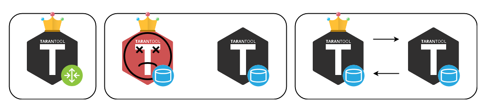

<!-- ############################################################ -->
## Tarantool

- База данных
- Сервер приложений на Lua

--

## Команда Tarantool

- Core Team - разработка ядра
- Solution Engineering - коммерческие проекты

???

Что такое тарантул
Кто мы и что делаем

<!-- ############################# -->
---

## Cartridge

- https://github.com/tarantool/cartridge-cli
- https://github.com/tarantool/cartridge

### Задачи

- Управление конфигурацией vshard
- Оркестрирование кластера
- Разработка распределённых приложений

<!-- ############################# -->
---
## Управление конфигурацией vshard

- "Из коробки" vshard управляется программно с помощью Lua.

```lua
sharding_cfg = {
    ['cbf06940-0790-498b-948d-042b62cf3d29'] = {
        replicas = { ... },
    },
    ['ac522f65-aa94-4134-9f64-51ee384f1a54'] = {
        replicas = { ... },
    },
}
```
```lua
vshard.router.cfg(...)
vshard.storage.cfg(...)
```

<!-- ############################# -->
---
## Управление конфигурацией vshard
- "Из коробки" vshard управляется программно с помощью Lua.

.override[]
???
Представьте: есть два шарда и роутер
--
.override[]
???
Представьте: вы хотите добавить ещё один шард
--
.override[]
???
Вам придётся обновить конфиг
--
.override[]
???
Стартануть новый инстанс
--
.override[]
???
И применить этот конфиг к старым инстансам
--
.override[]
???
Готово! Желательно на лету. Все конфиги должны быть одинаковые

<!-- ############################# -->
---
## Cartridge сам управляет конфигурацией vshard
- Появляется концепция "распределённая конфигурация".

???
Для этого распределённая конфигурация. Простой YAML файлик.

<!-- ############################# -->
---
## Cartridge сам управляет конфигурацией vshard
- Появляется концепция "распределённая конфигурация".
- Топология кластера: инстансы.
.ilustrate[]

???
Главное - топология.<br/>
Кластер строится из инстансов. Инстанс - процесс<br/>

<!-- ############################# -->
---
## Cartridge сам управляет конфигурацией vshard
- Появляется концепция "распределённая конфигурация".
- Топология кластера: **репликасеты** и инстансы.
.override[.ilustrate[]]
???
Группировка по репликасетам. Реплицируют данные м-м.

--
.override[.ilustrate[]]
???
Лидер - важный параметр топологии.<br/>
В вшарде это мастер.<br/>
Проблема с терминологией.<br/><br/>
Кластер следит за конфигом. 2pc. <br/>

<!-- ############################# -->
---
## Cartridge сам управляет конфигурацией vshard
- Появляется концепция "распределённая конфигурация".
- Топология кластера: репликасеты и инстансы.
- Протокол SWIM для мониторинга здоровья.
.override[.ilustrate[]]
???

--
.override[.ilustrate[]]
???
