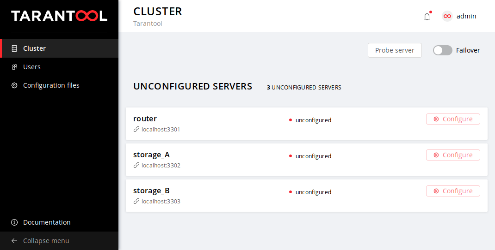
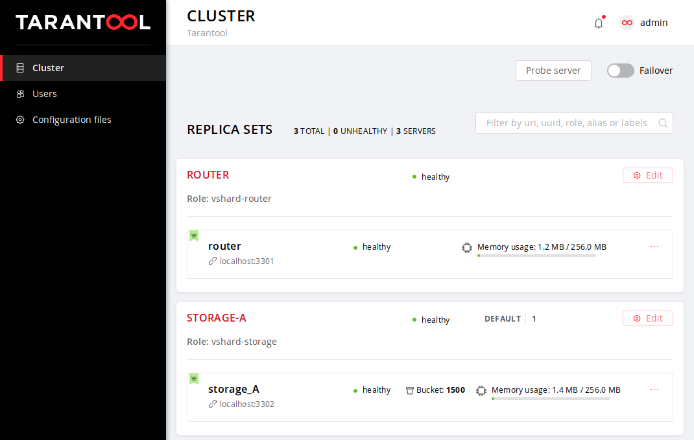

<!-- ############################################################ -->
## Cartridge CLI

### Установка

```console
$ tarantoolctl rocks install cartridge-cli
$ export PATH=$PWD/.rocks/bin/:$PATH
```

--
### Создание приложения из шаблона
```console
$ cartridge create --name myapp
```

<!-- ############################################################ -->
---
## Cartridge CLI

### Запуск приложения
```console
$ tarantoolctl rocks make
$ ./init.lua [ARGS]
```

--

### Деплой

```console
$ cartridge pack rpm myapp
$ sudo yum install ./myapp-0.1.0-1.rpm
```

<!-- ############################################################ -->
---
## Cartridge CLI

```yaml
myapp.router:
  advertise_uri: "localhost:3301"
  http_port: 8080

myapp.storage_A:
  advertise_uri: "localhost:3302"
  http_enabled: False

myapp.storage_B:
  advertise_uri: "localhost:3303"
  http_enabled: False
```

```console
$ sudo systemctl start myapp@router
$ sudo systemctl start myapp@storage_A
$ sudo systemctl start myapp@storage_B
```

<!-- ############################# -->
---
.center[]

<!-- ############################################################ -->
---
.center[]


<!-- ############################################################ -->
---

## Итого

1. Cartridge - это фреймворк.
1. Cartridge = cluster + roles.

### Код
- https://github.com/tarantool/cartridge-cli
- https://github.com/tarantool/cartridge

### Презентация

- https://rosik.github.io/2019-mailru-meetup

## Вопросы?

