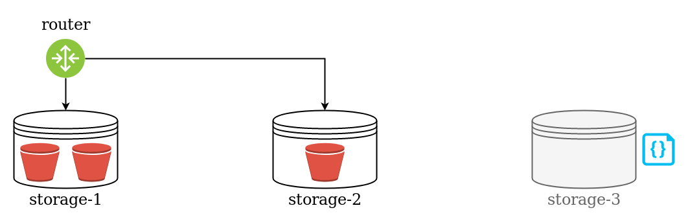
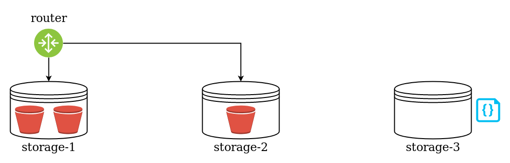
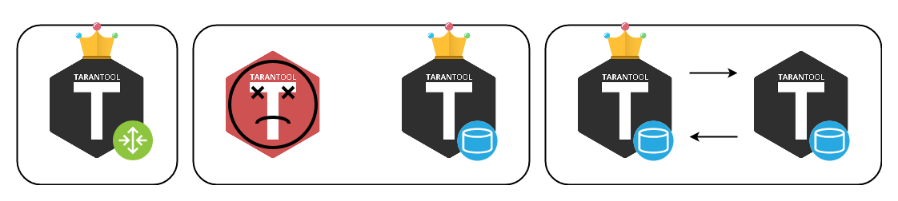

<!-- ############################################################ -->
## Tarantool Enterprise

- Коммерческий продукт.
- Появился в прошлом году.
- Объединяет несколько полезных для разработчика штук.

???
Я развиваю ТТЕЕ.<br/>
Большая команда. Две части. Много опыта.<br/>
Несколько полезных штук.


<!-- ############################################################ -->
---
## Первая штука: кластер

???
Первая штука - кластер. Флаконы. Вопрос- как? Ответ - кластер

<!-- ############################# -->
---
## Первая штука: кластер
### Удобное управление конфигурацией vshard

???
В основе кластера - вшард (opensource). Отклониться от темы<br/>
Вшард позволяет...

<!-- ############################# -->
---
## Первая штука: кластер
### Удобное управление конфигурацией vshard
- "Из коробки" vshard управляется программно с помощью Lua.

```lua
sharding_cfg = {
    ['cbf06940-0790-498b-948d-042b62cf3d29'] = {
        replicas = { ... },
    },
    ['ac522f65-aa94-4134-9f64-51ee384f1a54'] = {
        replicas = { ... },
    },
}
```
```lua
vshard.router.cfg(...)
vshard.storage.cfg(...)
```

???
Делается это так: Вшард управляется программно

<!-- ############################# -->
---
## Первая штука: кластер
### Удобное управление конфигурацией vshard
- "Из коробки" vshard управляется программно с помощью Lua.

.override[]
???
Представьте: есть два шарда и роутер
--
.override[]
???
Представьте: вы хотите добавить ещё один шард
--
.override[]
???
Вам придётся обновить конфиг
--
.override[]
???
Стартануть новый инстанс
--
.override[]
???
И применить этот конфиг к старым инстансам
--
.override[]
???
Готово! Желательно на лету. Все конфиги должны быть одинаковые

<!-- ############################################################ -->
---

## Первая штука: кластер
### Кластер сам управляет конфигурацией vshard

???
Никто не хочет заниматься этим вручную. Скрипты.<br/>
Помощь - кластер. Он сам.

<!-- ############################# -->
---
## Первая штука: кластер
### Кластер сам управляет конфигурацией vshard
- Кластер добавляет концепцию "распределённая конфигурация".

???
Для этого распределённая конфигурация. Простой YAML файлик.

<!-- ############################# -->
---
## Первая штука: кластер
### Кластер сам управляет конфигурацией vshard
- Кластер добавляет концепцию "распределённая конфигурация".
- Топология кластера: инстансы.
.ilustrate[]

???
Главное - топология.<br/>
Кластер строится из инстансов. Инстанс - процесс<br/>

<!-- ############################# -->
---
## Первая штука: кластер
### Кластер сам управляет конфигурацией vshard
- Кластер добавляет концепцию "распределённая конфигурация".
- Топология кластера: **репликасеты** и инстансы.
.override[.ilustrate[]]
???
Группировка по репликасетам. Реплицируют данные м-м.

--
.override[.ilustrate[]]
???
Лидер - важный параметр топологии.<br/>
В вшарде это мастер.<br/>
Проблема с терминологией.<br/><br/>
Кластер следит за конфигом. 2pc. <br/>

<!-- ############################# -->
---
## Первая штука: кластер
### Кластер сам управляет конфигурацией vshard
- Кластер добавляет концепцию "распределённая конфигурация".
- Топология кластера: репликасеты и инстансы.
- Протогол SWIM для мониторинга здоровья.
.override[.ilustrate[]]
???

Кластер следит за здоровьем.

--
.override[.ilustrate[]]
???
Фейловер.

