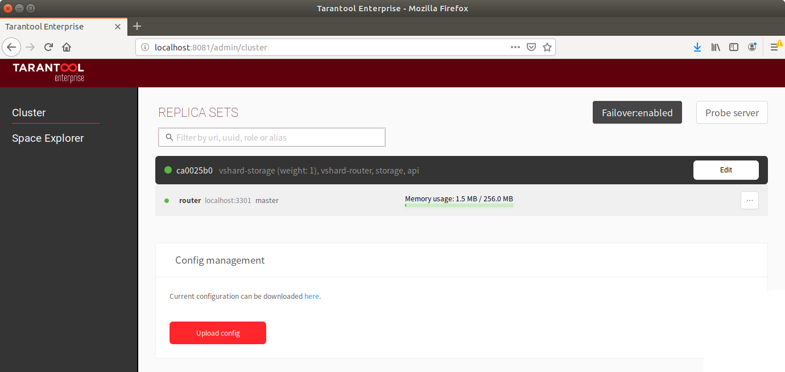
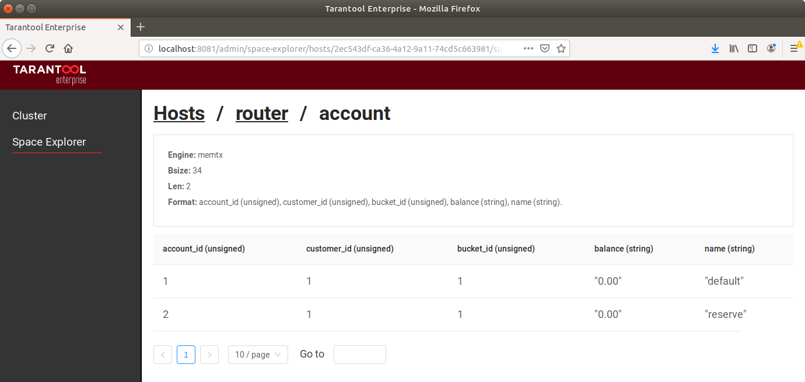

<!-- ############################################################ -->
## Шестая штука: web-интерфейс
### Топологией и конфигурацией кластера можно управлять мышкой

???
Вишенка на торте - веб-интерфейс.

<!-- ############################# -->
---
### Шестая штука: web-интерфейс

<!-- ############################################################ -->
---
### Шестая штука: web-интерфейс

<!-- ############################################################ -->
---

## Итого

1. Кластер сам управляет конфигурацией vshard.
1. Кластер помогает строить архитектуру приложений.
1. Tarantool Enterprise - это SDK.
1. Tarantool Enterprise не требователен к окружению.
1. Коннекторы.
1. Web-интерфейс.

---
## Вопросы?

 
 
С вами был Ярослав Дынников.

Telegram: @y_dynnikov 

