<!-- ############################################################ -->
# Алгоритм Raft
.footnote[https://raft.github.io]

## Задача

* Достичь консенсуса
--
* В ненадёжной сети
--

## Решение

* Реплицируемый конечный автомат  Replicated state machine

???

- Задача сводится к следующему: есть несколько серверов. Мы хотим чтобы
  данные на них были консистентны, и чтобы система была отказоустойчива.

- Есть много разных решений, Raft - одно из них. Я не хочу вам читать
  лекцию про все их семейство, а сфокусируюсь только на Raft'е.

- Построен с упором на понятность

- Поднимите руки кто с этой задачей знаком.

<!-- ############################################################ -->
---

# Реплицируемый конечный автомат

.center[]

<!-- ############################################################ -->
---

# Реквизит

.center[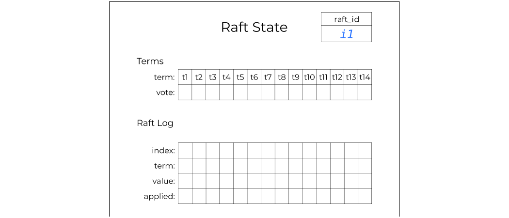]

<!-- ############################################################ -->
---
# Правила
.center[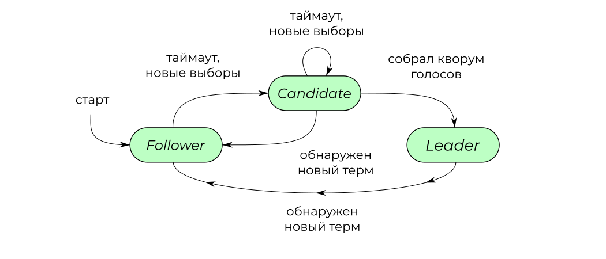]

---
# Правила
Follower:
- Пассивен
- Не отправляет никаких запросов

Leader:
- Обслуживает запросы
- Добавляет записи в журнал
- Пингует окружающих

Candidate:
- Проводит голосование

---
# Правила

.center[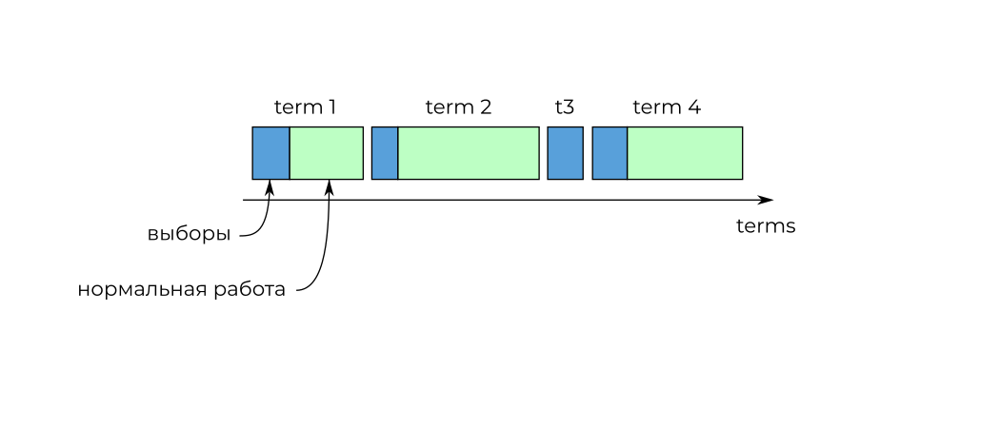]

---
## Все получают raft_id
.center[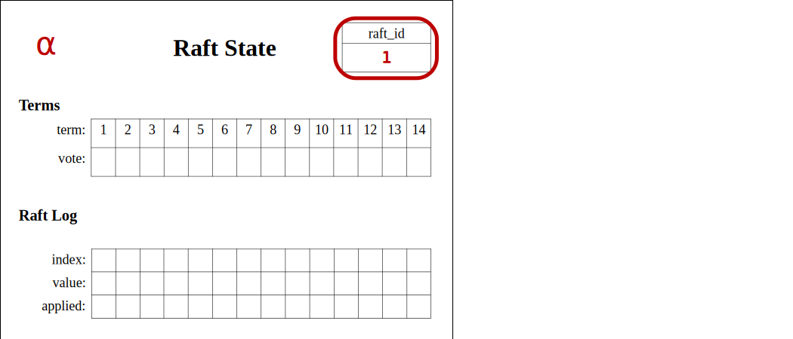]
???
- *Все участники*, проведите жеребьевку и заполните raft_id

---
## Все пропускают первые выборы
<!-- vote term -->
.center[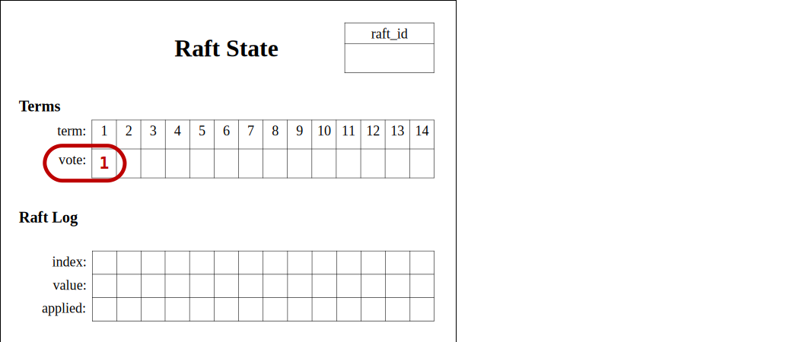]

???
- В оригинальной статье описание алгоритма начинается с выборов лидера,
  но мы с вами пойдем другим путем. Что такое термы я вам позже
  расскажу, а на первом раунде давайте не отлекаться
- Мы упростим задачу и ограничимся журналом
- *Все участники*, проголосуйте в первом терме за raft_id 1.
- Надеюсь очевидно, что если журнал у всех одинаковый, то машина состояний тоже будет консистентной

---
## Лидер заполняет журнал
.center[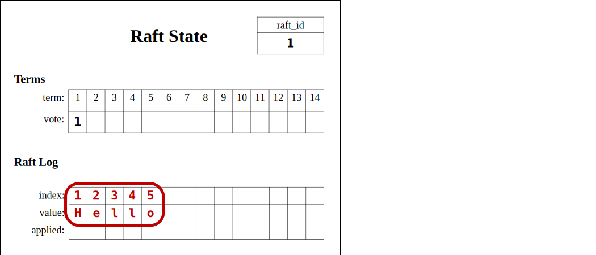]
???
- Тезис: Добавлять записи в рафт журнал имеет право только лидер
- Raft не защищает от византийских атак, поэтому просьба следовать протоколу.
- *Лидеры*, заполните журнал.

---
## AppendEntries RPC
<!-- Лидер отправляет запрос AppendEntries -->
.center[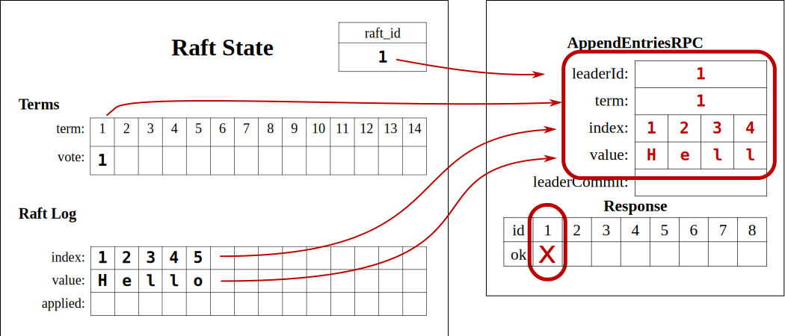]
???
- Оговориться про топологию сети.
- *Лидеры*, заполните AppendEntries.

---
## AppendEntries RPC
<!-- Фолловеры обрабатывают запрос AppendEntries -->
.center[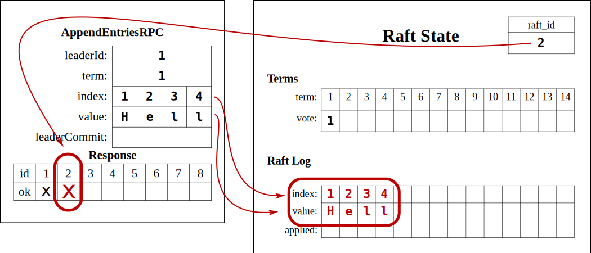]

---
## AppendEntries RPC
<!-- Лидер получает ответ на AppendEntries -->
.center[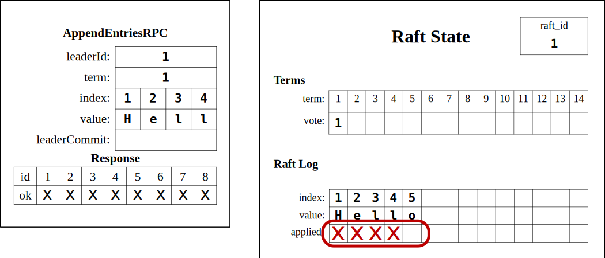]

---
## AppendEntries RPC
<!-- Лидер отправляет второй AppendEntries -->
.center[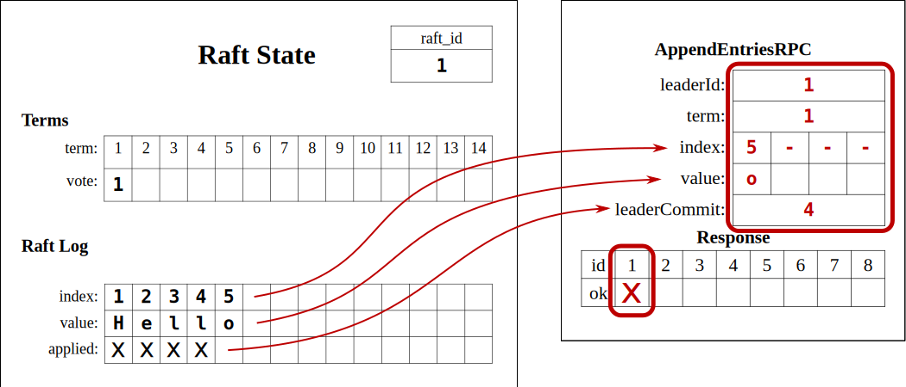]

???

- Тут приходит злой лаг и теряет пакет
- *Raft_id 6*, дропните пожалуйста этот пакет, не обраатывайте и больше никому не давайте.
- А в другом кластере raft_id 5.

<!-- ############################################################ -->
---
## Replicated state machine
.center[]
???
- Прежде чем идти дальше, подведем промежуточный итог.
- Вы отреплицировали 4 записи, вы молодцы.
- Но некоторые подробности остались за бортом - стейт машина. Что
  интересно, рафт не навязывает никакого физического смысла по поводу
  содержимого.

---
## Эволюция записей в журнале
.center[]

???

- Вы посмотрели на процесс глазами сервера, давайе теперь проговорим
  судьбу каждой записи в журнале ее глазами.

---
## Эволюция записей в журнале
.center[]

<!-- ############################################################ -->

---
## Кто-то начинает новый терм
.center[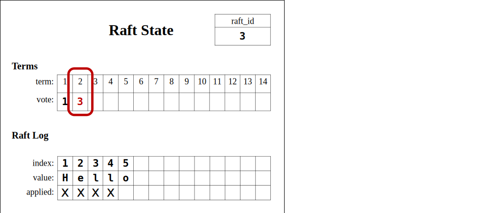]

---
## RequestVote RPC
<!-- Кандидат отправляет RequestVote -->
.center[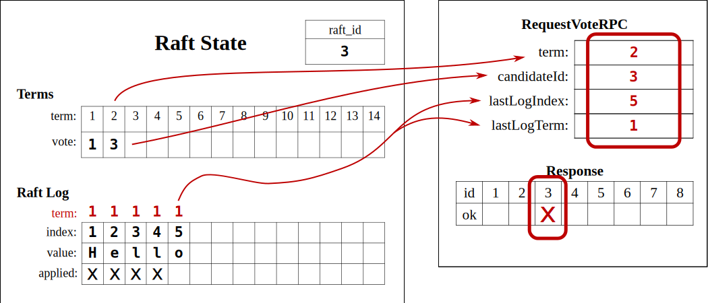]

---
## RequestVote RPC
<!-- Все обрабатывают RequestVote -->
.center[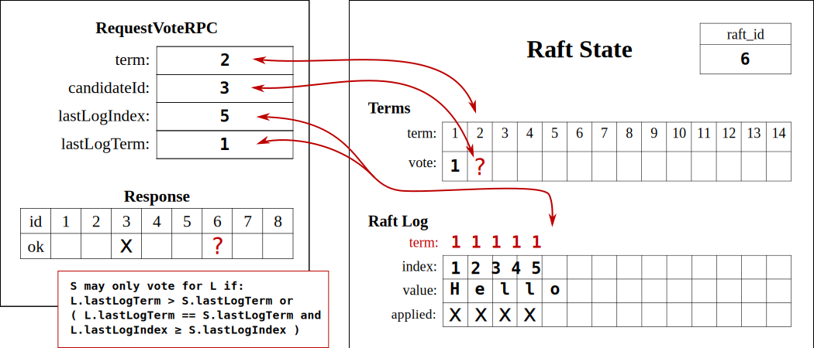]

---
## Состояния серверов
.center[]

???
- И опять сделаем паузу, я вам расскажу какие вообще статусы бывают.
  Их всего три.

<!-- ############################################################ -->
---
## Term 2
.center[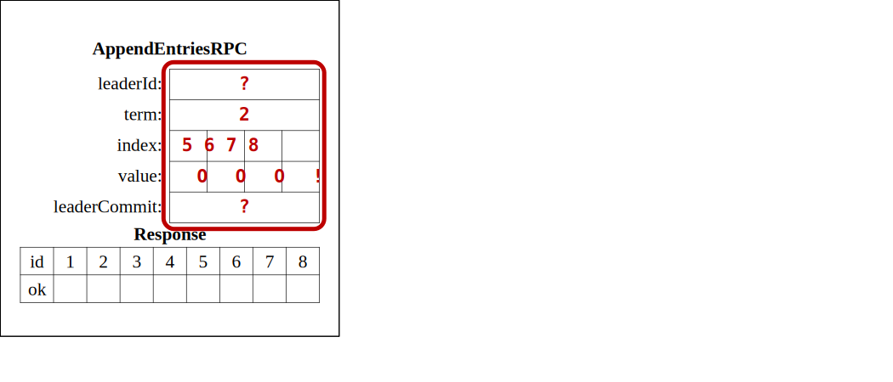]

---
## Откат журнала
.center[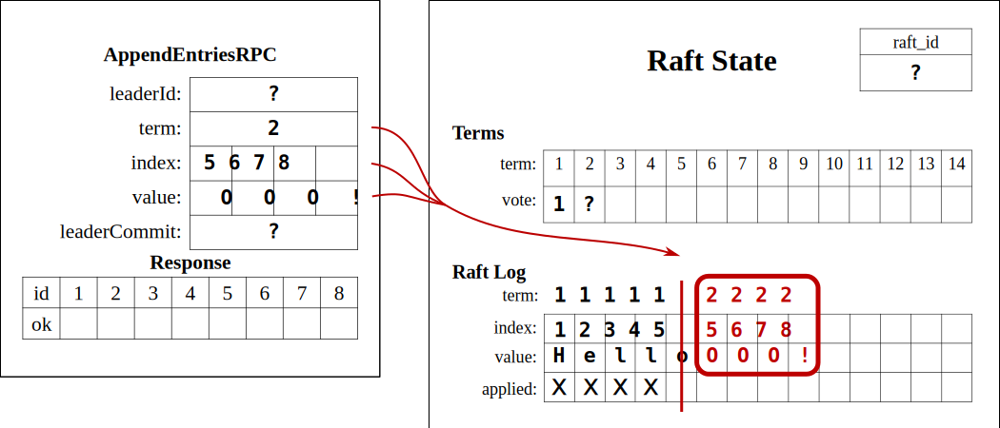]

???
- Мораль: незакоммиченные записи теряются.

<!-- ############################################################ -->
---
## Изменение топологии
.center[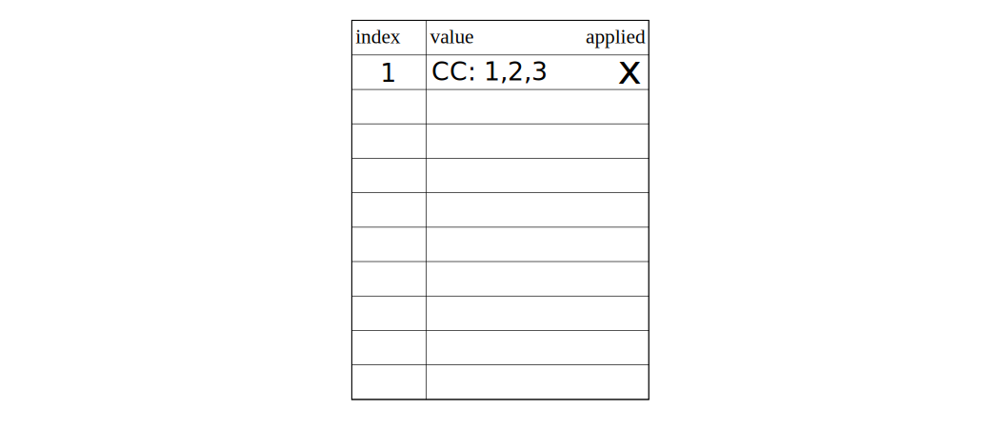]

---
## Изменение топологии
.center[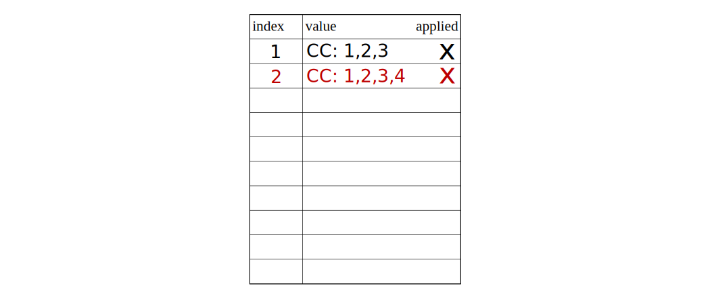]

---
## Изменение топологии
.center[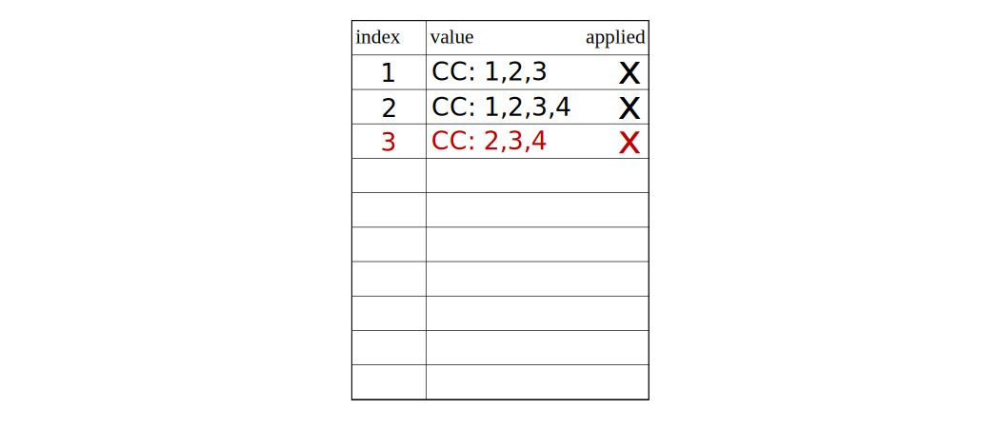]

---
## Joint consensus
.center[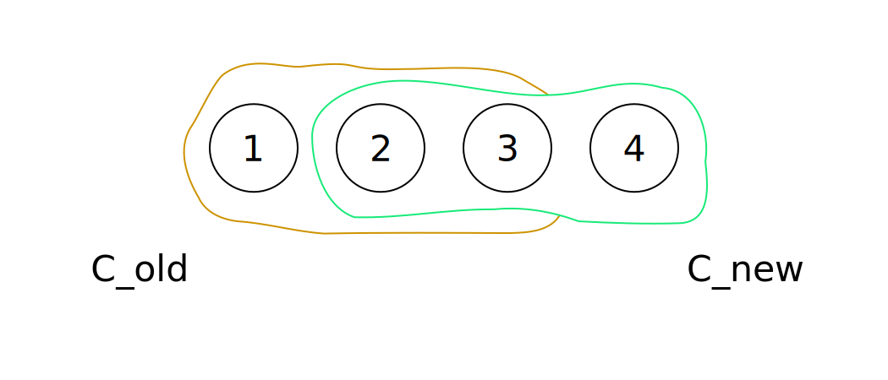]

---
## Joint consensus
.center[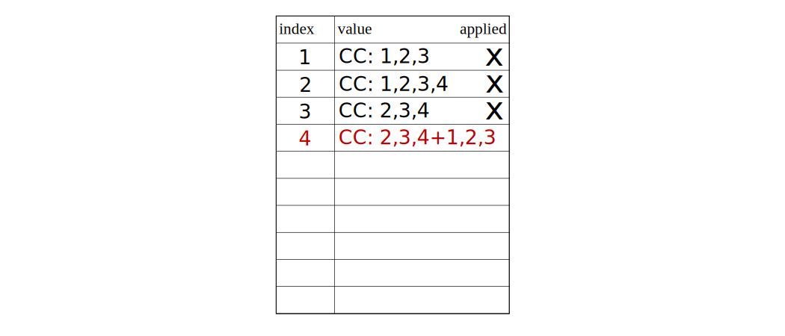]

---
## Joint consensus
.center[]

---
## Joint consensus
.center[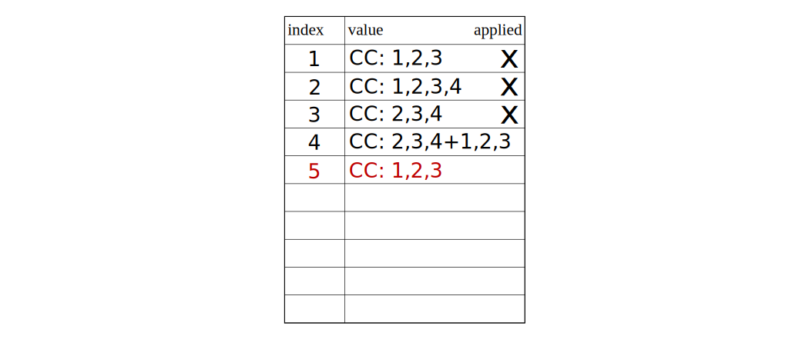]

<!-- ############################################################ -->
---
## Материалы

- Слайды: https://rosik.github.io/2022-fit-m

- Picodata: [@picodataru](https://t.me/picodataru), https://picodata.io/

- Raft: https://raft.github.io/

> In search of Understandable Consensus Algorithm. 
  Diego Ongaro and John Ousterhout. 
  Stanford University.
