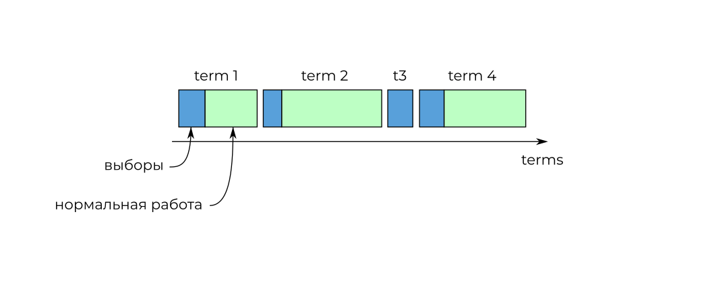
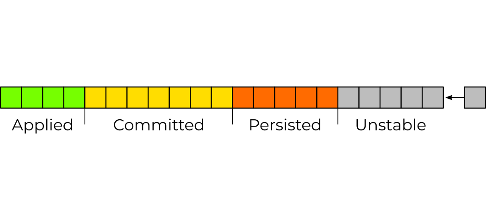

<!-- ############################################################ -->
# Алгоритм Raft
.footnote[https://raft.github.io]
## Задача
* Есть несколько серверов.
* Надо достичь консенсуса.
???
Задача сводится к следующему:
- Есть несколько серверов.
- Мы хотим чтобы данные на них были консистентны.
- Бахнем двухфазный коммит и цель достигнута.
---

# Алгоритм Raft
.footnote[https://raft.github.io]
## Задача
* Есть несколько серверов.
* Надо достичь консенсуса.
* В ненадёжной сети.
???
- Но!
- Сеть имеет свойство рваться.
---

# Алгоритм Raft
.footnote[https://raft.github.io]
## Задача
* Есть несколько серверов.
* Надо достичь консенсуса.
* В ненадёжной сети.

## Решение
* Реплицируемый конечный автомат.
* Replicated state machine.
???
- Есть много разных решений, Raft - одно из них.
- Я не буду даже упоминать другие, а буду тупо пиарить рафт.
- Построен с упором на понятность, но мозгу придется потрудиться.

<!-- ############################################################ -->
---
class: sectionpage
background-size: contain
background-image: url(template/bg-section.svg)
# Raft

<!-- ############################################################ -->
---
# Реплицируемый конечный автомат
.center[]
???
- Рафт в качестве решения предлагает...
- Строим терминологический фундамент.

<!-- ############################################################ -->
---
# Персистентное хранилище
.center[]
???
- А теперь взгляните на ваши листки.
- Стейт машины нет, есть только журнал.
- Сюда мы будем писать послание, по одной букве в клеточку.
- Содержание потом придумаете сами.

<!-- ############################################################ -->
---
# Лидер, фолловер, кандидат
.center[]
- *Leader* единственный пишет в журнал + пингует окружающих
- *Follower* пассивен, не отправляет никаких запросов
- *Candidate* проводит голосование
???
- Продолжаем знакомиться с терминологией

<!-- ############################################################ -->
---
# Термы
.center[]

<!-- ############################################################ -->
---
class: sectionpage
background-size: contain
background-image: url(template/bg-section.svg)
# Выборы лидера
## Игра 1

<!-- ############################################################ -->
---
# Выборы лидера
.center[]
<!-- See: https://css-tricks.com/svg-fragment-identifiers-work/ -->
???
- Транспорт-агностик
- В рафте это называется RPC

<!-- ############################################################ -->
---
# Кандидат: «Голосуйте за меня!»
.center[]

<!-- ############################################################ -->
---
# Фолловеры: «Ок».
.center[]
???
- Голосовать можно 1 раз за терм
- Голосуем за первого встречного
- Сначала персистим, потом отвечаем на запрос

<!-- ############################################################ -->
---
# Кандидат: «У-хуу!»
.center[]

<!-- ############################################################ -->
---
class: sectionpage
background-size: contain
background-image: url(template/bg-section.svg)
# Репликация журнала
## Игра 2

<!-- ############################################################ -->
---
# Лидер заполняет raft-журнал
.center[]

<!-- ############################################################ -->
---
# Лидер: «Заперсистьте!»
.center[]

<!-- ############################################################ -->
---
# Фолловеры: «Ок».
.center[]
???
- Сначала персистим, потом отвечаем на запрос

<!-- ############################################################ -->
---
# Лидер: «Отлично!»
.center[]

<!-- ############################################################ -->
---
# Состояние записей
.center[]

<!-- ############################################################ -->
---
# Лидер: «Реплицируйтесь!»
.center[]

<!-- ############################################################ -->
---
# Фолловеры: «Ок».
.center[]

<!-- ############################################################ -->
---
class: sectionpage
background-size: contain
background-image: url(template/bg-section.svg)
# Split vote
## Игра 3

<!-- ############################################################ -->
---
# Кандидаты: «Голосуйте за меня!»

.center[]
???
- i1, переверните листки, вы offline
- i4, i8 начинайте выборы

<!-- ############################################################ -->
---
# Фолловеры: «Не-а».
.center[]

<!-- ############################################################ -->
---
# Материалы

- Слайды: https://rosik.github.io/2022-fit-m

- Picodata: [@picodataru](https://t.me/picodataru), https://picodata.io/

- Raft: https://raft.github.io/

> In search of Understandable Consensus Algorithm. 
  Diego Ongaro and John Ousterhout. 
  Stanford University.
