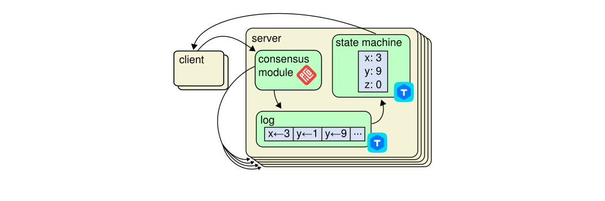

class: titlepage
background-size: contain
background-image: url(template/bg-face.svg)

# Переосмысление Picodata  в качестве cluster-first СУБД
## Ярослав Дынников
### Picodata
.footnote[Слайды: https://rosik.github.io/2024-shl]
???
- Привет меня зовут Ярослав Дынников
- Я разрабатываю распределенную СУБД Picodata
- И собираюсь сегодня познакомить с ней _вас_

<!-- ############################################################ -->
---
# План доклада
1. Питч
1. Архитектура и алгоритмы
1. Конкурентные преимущества
1. Расширение функциональности
???
- План доклада такой
- Я сначала запитчу наш продукт
- Потом обрисую на верхнем уровне архитектуру
- Расскажу про применяемые алгоритмы
- И из этого мы сможем сделать выводы о конкурентных отличиях пикодаты
  от других вендоров
- А если этого вам покажется мало, в заключение я расскажу как мы
  планируем дополнительно расширять функциональность при помощи плагинов
  на Rust

<!-- ############################################################ -->
---
# Picodata — это
- Distributed SQL
???
- С точки зрения пользователя мы — достаточно обычная база данных
- У нас есть SQL — `select * from`, `join`, и вот это все
- SQL, естесвенно, распределенный.

<!-- ############################################################ -->
---
# Picodata — это
- Distributed SQL
- Sharding, replication
???
- Пользователь взаимодействует с кластером как с единым ресурсом,
- а под капотом спрятано шардирование и репликация

<!-- ############################################################ -->
---
# Picodata — это
- Distributed SQL
- Sharding, replication
- In-memory
???
- Отличительных особенностей у нас есть две
- Первая заключается в том, что все данные лежат в оперативной памяти
- Этим мы режем косты по латенси за счет экономии на доступе к диску
- Это не значит что мы им не пользуемся, нет
- Запись идет в том числе и на жесткий диск
- Но чтение всегда выполняется из оперативной памяти

<!-- ############################################################ -->
---
# Picodata — это
- Distributed SQL
- Sharding, replication
- In-memory, single-threaded
???
- Вторая особенность состоит в том, что
- Доступ к локальному хранилищу реализован однопоточным, а потому без
  блокировок
- И это снова идет на руку производительности

<!-- ############################################################ -->
---
# Picodata — это
- Distributed SQL
- Sharding, replication
- In-memory, single-threaded
- Горизонтальное масштабирование
???
- Масштабируемся мы исключительно горизонтальным образом
- И даже если речь идет о современных многоядерных системах,
- то утилизация ресурсов достигается за счет развертывания нескольких
  инстансов субд, а не за счет многопоточности

<!-- ############################################################ -->
---
# Picodata — это
- Distributed SQL
- Sharding, replication
- In-memory, single-threaded
- Горизонтальное масштабирование
- ...
- Profit
???
- Итак, распределенный SQL, оперативная память, низкий латенси.

<!-- ############################################################ -->
---
     
# Picodata —
# Маленькие, быстрые данные
???
- Пикодата — маленькие, быстрые данные

<!-- ############################################################ -->
<!-- ############################################################ -->
<!-- ############################################################ -->
---
class: sectionpage
count: false
background-size: contain
background-image: url(template/bg-section.svg)
# Raft
???

<!-- ############################################################ -->
---
# Реплицируемый конечный автомат
<!-- .center[] -->
???
- Рафт в качестве решения предлагает...
- Строим терминологический фундамент.

<!-- ############################################################ -->
---
class: finalpage
background-size: contain
background-image: url(template/bg-final.svg)

# Материалы

- Слайды: https://rosik.github.io/2023-shl
- Picodata: https://picodata.io/
- Telegram: [@picodataru](https://t.me/picodataru)

.qr[
  **Обратная связь**:  
  
  <a href="https://conf.ontico.ru/online/shl2024/lectures/5409989/to-card">
  https://conf.ontico.ru 
  /online/shl2024 
  /details/5492379
  </a>  
]
