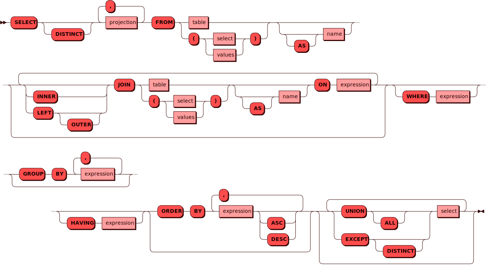

class: titlepage
background-size: contain
background-image: url(template/bg-face.svg)

# Переосмысление Picodata <br/>в качестве cluster-first СУБД
## Ярослав Дынников
### Picodata
.footnote[Слайды: https://rosik.github.io/2024-shl]
???
- Привет меня зовут Ярослав Дынников
- Я разрабатываю распределенную СУБД Picodata
- И собираюсь сегодня познакомить с ней _вас_

<!-- ############################################################ -->
---
# План доклада
1. Питч
1. Архитектура и алгоритмы
1. Конкурентные отличия
1. Расширение функциональности
???
- План доклада такой
- Я сначала запитчу наш продукт
- Потом я расскажу про архитектуру и применяемые алгоритмы
- Мы подробно рассмотрим две ключевые темы
- Управление кластером
- И распределенный SQL
- Но обо всем по-порядку, а пока поехали

<!-- ############################################################ -->
---
# Picodata — это
- Distributed SQL
???
- С точки зрения пользователя мы — достаточно обычная база данных
- У нас есть SQL — `select * from`, `join`, и вот это все
- SQL, естесвенно, распределенный, мы с вами на хайлоаде все-таки
- Пользователь взаимодействует с кластером как с единым ресурсом,
  а под капотом спрятано
---
# Picodata — это
- Distributed SQL
- Sharding, replication
???
- _шардирование_ и _репликация_
- Отличительных особенностей у нас две

---
# Picodata — это
- Distributed SQL
- Sharding, replication
- In-memory
???
- Первая заключается в том, что все данные лежат в _оперативной памяти_
- Этим мы режем косты по латенси за счет экономии на доступе к диску
- Это не значит что мы им не пользуемся, нет
- write ahead log пишетя на жесткий диск,
- Но чтение всегда выполняется из оперативной памяти

---
# Picodata — это
- Distributed SQL
- Sharding, replication
- In-memory, single-threaded
???
- Вторая особенность состоит в том, что
- Доступ к локальному хранилищу реализован однопоточным, а потому без
  блокировок
- И это снова идет на руку производительности

---
# Picodata — это
- Distributed SQL
- Sharding, replication
- In-memory, single-threaded
- Горизонтальное масштабирование
???
- Масштабируемся мы исключительно горизонтальным образом
- И даже если речь идет о современных многоядерных системах,
- то утилизация ресурсов достигается за счет развертывания нескольких
  инстансов субд, а не за счет многопоточности

---
# Picodata — это
- Distributed SQL
- Sharding, replication
- In-memory, single-threaded
- Горизонтальное масштабирование
- ...
???
- Итак, распределенный SQL, оперативная память, низкий латенси
- Что получится если все это сложить вместе?

<!-- ############################################################ -->
---
<br><br><br><br><br>
.center[

<!-- # Picodata — -->
<p>Маленькие, быстрые данные</p>
]
???
- Пикодата. Маленькие, быстрые данные

<!-- ############################################################ -->
---
class: sectionpage
count: false
background-size: contain
background-image: url(template/bg-section.svg)
# Катакомбы Picodata
## Обзорная экскурсия
???
- Ну а я пришел сегодня выступить в роли _экскурсовода_
- Хочу вас познакомить с продуктом изнутри, со стороны разработки

<!-- ############################################################ -->
---
# Что было до
???
- И начать я хочу с _исторической справки_
- Надо понимать, что такие сложные продукты, как распределенная субд, в
  вакууме не создаются
- И вообще исторические причины зачастую играют _решающую_ роль в вопросах
  выбора архитектуры
- Почему тот или иной код написан так а не иначе? _Исторически сложилось_
- И вот так исторически сложилось, что

---
# Что было до
## Tarantool
In-memory СУБД и сервер приложений на Lua<br>
Get your data in RAM. Get compute close to data. Enjoy the performance
???
- Я и мои коллеги в прошлом тесно связаны c тарантулом
- Tarantool — это БД и аппсервер в одном флаконе
- Идея в следующем
- Держите данные в оперативной памяти
- Проводите вычисления рядом с данными
- Наслаждайтесь скоростью
- Так гласит лозунг тарантула, хороший лозунг

---
# Что было до
## Tarantool
In-memory СУБД и сервер приложений на Lua<br>
Get your data in RAM. Get compute close to data. Enjoy the performance
## Vshard
Модуль шардирования на основе виртуальных бакетов
???
- Благодаря своему определению про аппсервер тарантул оброс богатой
  экосистемой
- И следующая технология которую я упомяну — это модуль Vshard
- Тарантул сам по себе умеет релицироваться
- А шардирование реализовано в виде отдельной библиотеки

---
# Что было до
## Tarantool
In-memory СУБД и сервер приложений на Lua<br>
Get your data in RAM. Get compute close to data. Enjoy the performance
## Vshard
Модуль шардирования на основе виртуальных бакетов
## Cartridge
Фреймворк для разработки распределенных приложений
???
- Чтобы всем эим урпавлять был картридж
- Изначальо он создавался как инструмент для управления кластером вшарда
- но со временем разросся в целый фреймворк
- Он закрывал вопросы связанные с разработкой и тестированием приложений,
- Ну и для эксплуатации служил
- Вот такая богатая экосистема

<!-- ############################################################ -->
---
# Особенности экосистемы
## Performance
Быстро, но не всегда предсказуемо (LuaJIT, GC)
???
- Но у нее были особенности, которые никак не удавалось решить
- Во-первых к быстродействию были вопросики
- Сервер приложений на луа это не что иное как интерпретатор LuaJIT
- с just in time компиляцией
- и с GC stop the world
- Обычно все идет хорошо, но если нет, то удачи с отладкой

---
# Особенности экосистемы
## Performance
Быстро, но не всегда предсказуемо (LuaJIT, GC)
## Функциональные
SQL есть, но в рамках одного узла
???
- Во-вторых огорчает чисто функциональное ограничение
- SQL есть, но только локальный
- А шардирование уровнем выше
- Получается SQL ничего не знает что данные разделены
- Это странно

---
# Особенности экосистемы
## Performance
Быстро, но не всегда предсказуемо (LuaJIT, GC)
## Функциональные
SQL есть, но в рамках одного узла
## Разработка
Очень интересно, но сложно
???
- Разработка была очень увлекательной, но сложной
- Вся экосистема вокруг тарантула достаточно специфичной
- Это во-первых _обучение_ делает более трудоемким
- Да и в принципе разработка распределенных приложений — наука не из простых
- В качестве иллюстрации приведу такой пример из кода, который достался
  мне на ревью.
- Функция локально открывает транзакцию, потом делает
  несколько вызовов по сети на другие узлы, потом коммитит локально
  транзакцию.
- Ах если бы распределенные транзакции работали так просто

---
# Особенности экосистемы
## Performance
Быстро, но не всегда предсказуемо (LuaJIT, GC)
## Функциональные
SQL есть, но в рамках одного узла
## Разработка
Очень интересно, но сложно
## Эксплуатация
То слишком гибко, то слишком жестко (two-phase commit)
???
- Ну и вернемся к тарантулу. Про эксплуатацию теперь. Тут возникает диссонанс
- Картридж позволял управлять каждым репликасетом в отдельности
- А типичный кластер ­это 100 роутеров и 200 стораджей с репликацией
- И управлять каждым в отдельности ну никак не хочется
- Картриджем управлял ансибл, а конфиги для ансибла генерировал
  питоновский скрипт
- А хуже всего то, что картридж не использовл кворумный подход в
  хранении конфигурации, а требовал консистентности на всех инстансах до
  одного
- Конфигурация - это ..., для распространения конфигурации использовался
  двухфазный коммит ...

<!-- ############################################################ -->
---
# План
1. Заменить two-phase commit на Raft
1. Реализовать распределенный SQL
2. И все это на Rust
3. ???
4. Profit
???
- Итак, у нас созрел план
- Заменяем двухфазный коммит из картриджа на Raft,
  про него я в следующем блоке расскажу
- Другой рукой реализуем распределенный sql
- Попутно переписываем все это на Rust чтобы нас GC не донимал
- Забегая вперед сразу скажу что у нас все получилось
- А теперь же перейдем к архитектуре и алгоритмам

<!-- ############################################################ -->
---
class: sectionpage
count: false
background-size: contain
background-image: url(template/bg-section.svg)
# Управление кластером

<!-- ############################################################ -->
---
# Raft
Алгоритм для решения задач консенсуса<br>
в сети ненадежных вычислений<br><br>
.center[]
???
- Raft - это ... Так нам википедия говорит
- А я попробую объяснить что это значит на пальцах
- Стопка желтых прямоугольников на картинке - это узлы в кластере
- Их много и все одинаковые
- Они хотят согласованно хранить некоторое состояние (state machine)
- Передать состоние между инстансами мы не можем
- Вместо этого raft предлагает сохранить все _изменения_ состояния в
  некоторый журнал
- Raft определяет правила, по которым этот журнал дожен реплицироваться
- Таким образом имея одинаковый журнал мы можем быть уверены что и
  состояние отличаться не будет
- Что именно представляет из себя рафт журнал и состояние алгоритм
  не говорит, это он оставляет на усмотрение разработчика

---
# Raft
Алгоритм для решения задач консенсуса<br>
в сети ненадежных вычислений<br><br>
.center[]
???
- Если посмотреть как это ложится на нашу экосистему получится такая картина
- И состояние и журнал хранится в спейсах тарантула
- Raft-журнал это отдельный спейс
- Аналогия с фс
- Таким образом у нас есть механизм, который обеспечит консистентность

<!-- ############################################################ -->
---
# Cluster manager
.center[]
???
- Ну а мы продолжаем нашу экскурсию
- Взгляните на эту схему
- Она иллюстрирует идею о том, как пикодата объединяет несколько
  инстансов в кластер.
- У каждого инстанса есть свое локальное хранилище, а кластер менеджер
  позволяет слаженно ими управлять

---
# Cluster manager
.center[]
???
- Каждый инстанс представляет из себя отдельный инстанс тарантула
- Пикодата, например, координирует кто с кем должен реплицироваться

---
# Cluster manager
.center[]
???
- И вот тут маленький взрыв мозга обычно происходит, смотрите
- У нас есть два уровня репликации. Внутри репликасета и на весь кластер

---
# Cluster manager
.center[]
???
- На этом сложности не заканчиваются, потому что поверх тарантульной
  репликации есть еще слой логики с шардированием
- На этом уровне пикодата должна настроить где роутеры, где стораджа
- Если добавился новый сторадж, то об это должны сначала узнать все
  роутеры. Все роутеры должны узнать о новом сторадже до того как
  на него


<!-- ############################################################ -->
---
# Иерархия
.center[]
???
- Итак, еще одна картинка
- Та же самая мысль, но с другого ракурса
- Инстансы объединяются репликасеты
- Репликасеты в тиры
- А управляет на верхнем уровне всем кластер

<!-- ############################################################ -->
---
# Описание структуры
<style type="text/css">
.tg  {border-collapse:collapse;border-spacing:0;float:left;margin-right:60px}
.tg td{border-color:black;border-style:solid;border-width:1px;font-size:20pt;
  overflow:hidden;padding:10px 5px;word-break:normal;}
.tg th{border-color:black;border-style:solid;border-width:1px;font-size:20pt;
  font-weight:normal;overflow:hidden;padding:10px 5px;word-break:normal;}
.tg .tg-c{border-color:inherit;text-align:center;vertical-align:top}
.tg .tg-l{border-color:inherit;text-align:left;vertical-align:top}
.tg .tg-lb{font-weight:bold;text-align:left;vertical-align:top}
</style>

<table class="tg">
  <thead>
  <tr> <th class="tg-c" colspan="2">INSTANCE</th> </tr>
  </thead>
<tbody>
  <tr> <td></td>                <td class="tg-l">raft_id</td></tr>
  <tr> <td class="tg-l">PK</td> <td class="tg-l">instance_id</td> </tr>
  <tr> <td class="tg-l">FK</td> <td class="tg-l">replicaset_id</td> </tr>
  <tr> <td></td>                <td class="tg-lb">current_state</td> </tr>
  <tr> <td></td>                <td class="tg-lb">target_state</td> </tr>
</tbody>
</table>
.footnote[
State: Online ⇆ Offline; generation<br>
Важно: не status, а state!<br>
]
???
- То что я сейчас рассказывал было посвящено одному фиксированному состоянию
  теперь давайте обсудим как оно изменяется во времени
- Давайте определимся что же такое состояние кластера
- Все просто, состояние кластера - это совокупность состояний всех инстансов
- А состояние инстанса - это один з двух вариантов - онлайн или оффлайн
- И вот что важно, слово состояние на английский можно перевести
- Когда мы говорим о состоянях важно использовать именно слово state
- Состояние - это в первую очередь как кластер
- Пример с фейловером
<!--
<table class="tg" style="">
  <thead>
  <tr> <th class="tg-c" colspan="2">REPLICASET</th> </tr>
  </thead>
<tbody>
  <tr> <td class="tg-l">PK</td> <td class="tg-l">replicaset_id</td> </tr>
  <tr> <td class="tg-l">FK</td> <td class="tg-l">tier</td> </tr>
  <tr> <td></td>                <td class="tg-lb">current_master</td> </tr>
  <tr> <td></td>                <td class="tg-lb">target_master</td> </tr>
</tbody>
</table>
-->

<!-- ############################################################ -->
---
# Лидер, фолловер, кандидат
.center[]
*Leader* единственный пишет в журнал + пингует окружающих<br>
???
- Мы можете меня спросить, а кто конкретно из всего кластера это делает
- Чтобы ответить на этот вопрос
- Raft - централизованный протокол
--
*Follower* пассивен, не отправляет никаких запросов<br>
--
*Candidate* проводит голосование<br>

<!-- ############################################################ -->
---
# Отказоустойчивость
- Сотни инстансов в кластере
- 5 из них *voters*, остальные *learners*
- 1 из них *Leader*, остальные *Follower*
???
- А вот послушайте с какой инженерной задачкой нам пришлось столкнуться

<!-- ############################################################ -->
---
class: sectionpage
count: false
background-size: contain
background-image: url(template/bg-section.svg)
# Работа с данными
???
- На этом про кластер хватит, будем считать он есть и работает
- Поговорим про хранение данных

<!-- ############################################################ -->
---
# Хранение данных
- Таблицы бывают *шардированные* и *глобальные*
- Схема данных единая на весь кластер
- Доступ к данным посредством языка SQL
???
- В Пикодате есть две разновидности таблиц — глобальные и шардированные
- И те и другие реализованы поверх спейсов тарантула, но отличий масса
- Глобальные таблицы реплицируются на весь кластер алгоритмом рафт
  и содержимое глобальных таблиц одинаково на всех инстансах в кластере
- В них же пикодата хранит _конфигурацию кластера_
- В шардированных таблицах разные репликасеты хранят разные _бакеты_
  (сегменты данных)
- Реплицирует их тарантул, а не рафт
- Схема данных является общей на весь кластер

<!-- ############################################################ -->
---
# Распределенный SQL
<div style="float:left;width:30%;line-height:1.3"><p>
INNER JOIN<br>
LEFT OUTER JOIN<br>
WHERE<br>
WHERE ... IN<br>
GROUP BY<br>
HAVING<br>
ORDER BY<br>
UNION ALL<br>
DISTINCT<br>
EXCEPT DISTINCT<br>
</p></div>

.footnote[https://docs.picodata.io/picodata/24.4/sql_index/]
???
- Эта картинка здесь для устрашения приведена, она иллюстрирует многообразие
  фич, реализованных в селекте
- А я попробую объянить как это все работает на примере обработки одного запроса

<!-- ############################################################ -->
---
# AST
AST == abstract syntax tree
.center[]
???
- За отправную точку возмем достаточно незамысловатый запрос
- Здесь я предполагаю что у нас есть таблица t с двумя колонками a и b
- Первый шаг обработки запроса вопросов не должен вызвать
- Первым этапом выполняется синтаксический разбор результатом которого
  становится abstract syntax tree такого вот вида

---
# План запроса (IR)
IR == intermediate representation == plan
.footnote[SELECT b FROM t WHERE a = 1]
.center[]
???
- После того как AST построен из него надо построить план запроса
- В пикодате план называется IR
- Это сложный процесс и в деталях я его рассказать не успею
- Модуль который это делает занимает \> 1000 LoC
- Читайте хабр
- Но основные этапы я на словах расскажу
- Чтобы превратить AST в IR пикодата выполняет ряд хитрых трансформаций
  одну за одной
- Во-первых выполняется перегруппировка узлов. Если на прошлой картинке
  эта троица располагались на одном уровне, то в плане запроса они
  олицетворяют реляционные операторы и выполняются снизу вверх один за
  одним
- Также на этом этапе подтягивается информация о формате таблиц
  и какие колонки вообще есть
-

---
# План запроса
IR == intermediate representation == plan
.footnote[SELECT b FROM t WHERE a = 1]
.center[]
???
- Трансформация на этом не заканчивается и еще один важный этап - это
  определить как распределены данные. Эта информация понадобится нам
  чуть позже, а мы пока переходим к седующему

---
# Обработка запроса (1)

## Router
SQL → AST → IR → _execute_
???
- Пробежимся еще раз
- SQL запрос парсится в AST
- Потом из AST строится план запроса IR
- IR исполняет executor

---
# Bucket discovery
<br>
.footnote[SELECT b FROM t WHERE a = 1]
.center[]
???
- Выполнение запроса также включает несколько этапов
- Основная задача — выполнить map-reduce, но сначала надо определить где
- Делается это так ...

---
# IR → VDBE
<br>
.footnote[SELECT b FROM t WHERE a = 1]
.center[]
- Теперь мы знаем где искать данные и можно отправлять запрос на сторадж
- Тут уже в игру вступает тарантульный локальный sql
- Наш IRчик преобразуется в набор vdbe инструкций, тарантул их
  выполняет, и на выходе мы получаем готовую таблицку с кусочком данных

---
# Обработка запроса (2)


## Router
SQL → AST → IR → execute
## Executor
IR subtree → bucket discovery → <br>
→ map → VDBE ops → reduce
???
- Вовращаемся к верхнеуровневой картинке и проговариваем еще раз
- Reduce - это конкатенация результатов со всех стораджей
- В нашем примере таблица была одна, поэтому полученный результат можно
  сразу


<!-- ############################################################ -->
---
# Итого
<p>История Tarantool<p\>
<p>Алгоритм Raft<p\>
<p>Иерархия — инстансы, репликасеты, тиры, кластер<p\>
<p>Не status, а state<p\>
<p>Лидер, фолловер, кандидат<p\>
<p>Динамическое переключение голосующих узлов<p\>
<p>Распределенный SQL<p\>
???
- Ни одной новой идеи, но комбинация уникальна
- Например, точечные запросы по предагрегированным витринам данных
<!-- ############################################################ -->
---
class: finalpage
background-size: contain
background-image: url(template/bg-final.svg)

# Материалы
- Слайды: https://rosik.github.io/2024-shl
- Picodata: https://picodata.io/
- Telegram: [@picodataru](https://t.me/picodataru)

.qr[
  **Обратная связь**:<br/><br/>
  
  <a href="https://conf.ontico.ru/online/shl2024/lectures/5409989/to-card">
  https://conf.ontico.ru<br>
  /online/shl2024<br>
  /details/5492379
  </a><br/><br/>
]
???
- Голосование
- Вопросы
- Награждение

<!-- - 24 активных контрибутора в репе, 1 внешний -->
<!-- - Initial commit 22 ноября 2021  -->
<!-- ############################################################ -->
---
# Состояние записей в raft-журнале
.center[]

<!-- ############################################################ -->
---
# Виды операций в raft-журнале
```rust
pub enum Op {
    Nop,
    Dml(Dml),
    DdlPrepare { schema_version: u64, ddl: Ddl },
    DdlCommit,
    DdlAbort,
    Acl(Acl),
}
```
